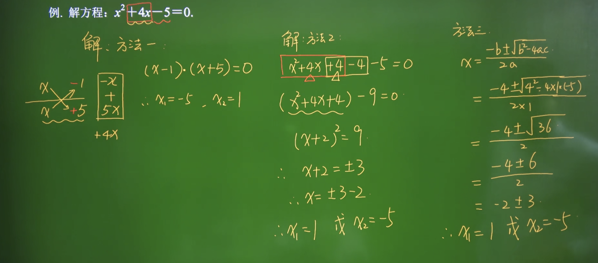

# Math
## 希腊字母

| 大写 | 小写 | 英文注音 | 国际音标注音 | 中文注音 |
| :--- | :--- | :------- | :----------- | :------- |
| Α    | α    | alpha    | alfa         | 阿耳法   |
| Β    | β    | beta     | beta         | 贝塔     |
| Γ    | γ    | gamma    | gamma        | 伽马     |
| Δ    | δ    | deta     | delta        | 德耳塔   |
| Ε    | ε    | epsilon  | epsilon      | 艾普西隆 |
| Ζ    | ζ    | zeta     | zeta         | 截塔     |
| Η    | η    | eta      | eta          | 艾塔     |
| Θ    | θ    | theta    | θita         | 西塔     |
| Ι    | ι    | iota     | iota         | 约塔     |
| Κ    | κ    | kappa    | kappa        | 卡帕     |
| ∧    | λ    | lambda   | lambda       | 兰姆达   |
| Μ    | μ    | mu       | miu          | 缪       |
| Ν    | ν    | nu       | niu          | 纽       |
| Ξ    | ξ    | xi       | ksi          | 可塞     |
| Ο    | ο    | omicron  | omikron      | 奥密可戎 |
| ∏    | π    | pi       | pai          | 派       |
| Ρ    | ρ    | rho      | rou          | 柔       |
| ∑    | σ    | sigma    | sigma        | 西格马   |
| Τ    | τ    | tau      | tau          | 套       |
| Υ    | υ    | upsilon  | jupsilon     | 衣普西隆 |
| Φ    | φ    | phi      | fai          | 斐       |
| Χ    | χ    | chi      | khai         | 喜       |
| Ψ    | ψ    | psi      | psai         | 普西     |
| Ω    | ω    | omega    | omiga        | 欧米     |

## 基础概念
* 自然数。从0开始算
* 质数。只能被1和他本事整除的正整数（即只有1和他本事两个约数）叫质数，反之为合数，1既不是质数也不是合数。  

  > 质数:2,3,5,7,11,13,17,19  
  > 合数：4，6，8，10
  > 2是唯一一个即使质数也是偶数的正整数，即是唯一是偶质数，大于2的质数必定是奇数  
  > 若正整数a,b的乘积是质数p，则a = p,b = 1或 b = p, a = 1  
  > 若两个质数的和或差是奇数，那么其中一个质数必然是2。因为只有偶±奇才能等于奇数  
  > 若两个质数的乘积是偶数，那么其中一个质数必然是2。因为只有奇乘偶才能是偶数

* 互质数。公约数只有1的两个数叫互质数。如：9的约数{1,3,9},16的约数{1,2,4,8,16} 它们的公约数1，所以它们是互质数。

* 最小公倍数

## 方程
### 一元二次
* 直接开平方法

  > 若 $x^2=a(a \geq 0)$ ，则 $x=\pm \sqrt{a}$

* 配方法

  > 但二次项系数为1的时，方程两边都加上一次项系数一半的平方。  
  > 构成一个完全平方公式即(a+b)²=a²+2ab+b²、(a-b)²=a²-2ab+b²  
  > 平方差公式：(a+b)(a-b)=a²-b²

  解方程：$x^2 + 3x = 0$  
  $x^2 + 3x + (\frac{3}{2})^2 = (\frac{3}{2})^2$  
  $(x+\frac{3}{2})^2 = \frac{9}{4}$  
  $x+\frac{3}{2} = \pm \frac{3}{2}$  
  $x = -\frac{6}{2} = -3$ 或 x = 0

* 因式分解法

  > 若(x-a)(x-b)=0，则x-a=0或x-b=0

* 公式法

  > 方程$ax^2 + bx + c = 0(a \neq 0, 判别式：b^2-4ac\geq0)$,则解是$x=\frac{-b\pm \sqrt{b^2-4ac}}{2a}$

* 根与系数的关系

  > 若$ax^2 + bx + c = 0(a \neq 0)$的两个跟为$x_1,x_2$  
  > 则$x_1+x_2=- \frac{b}{a}$，$x_1x_2=\frac{c}{a}$

## 集合
* 集合元素的性质：确定性、无序性、互异性
* 元素与集合的关系
  * 属于 $\in$  , 不属于 $\notin$  
    元素a在集合A里面：a $\in$ A  
    元素a不再集合A里面: a $\notin$ A
* 常见数集符合
  * $N$ 自然数集  `0,1,2,3……`
  * $N^*$ 或 $N_+$ 正整数集 `1,2,3……`
  * $Z$ 整数集，包含正整数，负整数，零
  * $Q$ 有理数集，有理数是整数（正整数、0、负整数）和分数的统称
  * $R$ 实数集，实数是有理数和无理数的总称
* 集合之间的关系
  * A=B，相等。集合A和集合B中说有元素都相同
  * A$\subseteq$B，子集。B大，其实也有可能相等
  * A$\subseteq$B，真子集，符号有错误，下面是一个不等于号$\neq$。也是B大，而且不可能相等。
  * $\emptyset$，空集。空集是任何集合在子集，是任何非空集的真子集
  * A$\cup$B，并集。取两个集合的所有元素
  * A$\cap$B，交集。取两个集合相等的部分
  * $\complement_UA$，补集。A集合在全集U中，取U中除A集合剩下的部分
* 必然结论
  * A$\cup$B = A 可推理出  A$\supseteq$B
  * A$\cap$B = A 可退理出  B$\supseteq$A
  * A$\cap$A = A
  * $A\cap \emptyset = \emptyset$
  * $A\cap\complement_UA = \emptyset$
  * $A\cup\complement_UA = U$
  * $\complement_U(\complement_UA) = A$
  * $A\subseteq B$ 可推理出 $A\cap B = A$ 可推理出 $A\cup B = B$ 可推理出 $\complement_UB \subseteq \complement_UA$ 可推理出 $A \cap (\complement_UB) = \emptyset$
  * 集合A中有n个元素，那么他的子集个数为$2^n$，真子集个数为$2^n-1$，非空真子集个数为$2^n-2$  
  > 例：集合A = {1,2,3}   
  子集有：空集、{1}、{2}、{3}、{1,2}、{1,3}、{2,3}、{1,2,3} 共8个 =  $2^3$  
  真子集去掉{1,2,3} 共7个  
  非空真子集去掉{1,2,3}和空集，共6个

## 函数
函数三要素：定义域，对应关系，值域。

函数：$y=f(x),x \in A$

* 定义域：自变量x取值范围构成的集合
* 值域：函数值的集合 {$f(x), x\in A$}

## 方差

  方差是各个数据与平均数之差的平方的和的平均数。

  $S^2 = \frac{1}{n}[(x_1-x)^2 + (x_2-x)^2 + ... + (x_n-x)^2]$

  $S^2 = \frac{\sum^n_{i=1}(x_i - x)^2}{n}$

  其中，x表示样本的平均数，n表示样本的数量，$x_i$表示个体，而$S^2$就表示方差。

  > 两人的5次测验成绩如下：X： 50，100，100，60，50，平均值E(X)=72；Y：73， 70，75，72，70 平均值E(Y)=72。平均成绩相同，但X 不稳定，对平均值的偏离大。方差描述随机变量对于数学期望的偏离程度。  
  > 方差越小越稳定

## 标准差

  $δ=\sqrt(\frac{(x_1-x)^2 +(x_2-x)^2 +......(x_n-x)^2)}{n})$

  方差=标准差的平方

## 数据标准化 Normalization Method
> 机器学习算法中要求样本间的距离就要使用数据归一化，把数据映射到同一尺度。  
> 数据归一化是为了解决量纲的问题，使数据映射到同一尺度。举2个例子：比如两个特征为月收入和和身高。月收入范围5000元-30000元，身高为1m-2.5m，在计算两个特征的欧式距离时，由于取值范围身高这一特征被忽略了，这样就让身高这一特征的信息失效了。所以要使用数据归一化把数据映射到同一尺度

* 标准归一化 Z-score标准化

  $x∗ = \frac{x−μ}{δ}$

  其中 μ为所有样本数据的均值（mean）， δ为所有样本数据的标准差（standard deviation）。

* 最大最小归一化

  也称为离差标准化，是对原始数据的线性变换，使结果值映射到 [0 - 1] 之间。

  $x∗=\frac{x − x_{min}}{x_{max} − x_{min}}$

  其中 $x_{max}$为样本数据的最大值， $x_{min}$为样本数据的最小值。这种方法有个缺陷就是当有新数据加入时，可能导致 $x_{max}$和 $x_{min}$的变化，需要重新定义。
