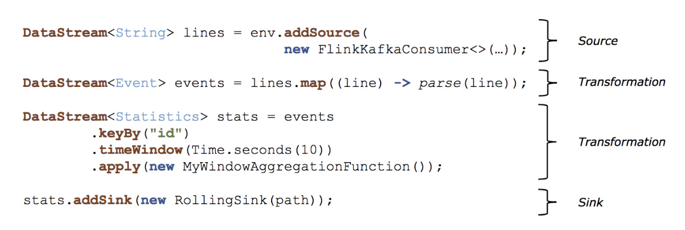

Flink
------
大数据计算技术演进：
1. Hadoop 承载的 MapReduce
1. 支持 DAG（有向无环图）框架的计算引擎 Tez 和 Oozie，主要还是批处理任务
1. 支持 Job 内部的 DAG（有向无环图），以 Spark 为代表
1. 大数据统一计算引擎，包括流处理、批处理、AI、Machine Learning、图计算等，以 Flink 为代表

## 场景
* 业务数据处理，聚合业务数据，统计分析
* 流量日志，动态数据监控
* 交通信号灯数据
* 道路上车流量统计（拥堵状况）
* 公安视频监控
* 服务器运行状态监控
* 金融证券公司实时跟踪股市波动，计算风险价值
* 数据实时 ETL
* 银行或者支付公司涉及金融盗窃的预警
* 扩展库：CEP（复杂事件处理）、机器学习、图形处理

## 大数据
### 数据集类型
* 无穷数据集：无穷的持续集成的数据集合
  > 用户与客户端的实时交互数据  
  应用实时产生的日志  
  金融市场的实时交易记录

* 有界数据集：有限不会改变的数据集合

### 数据运算模型
* 流式：只要数据一直在产生，计算就持续地进行
* 批处理：在预先定义的时间内运行计算，当计算完成时释放计算机资源

Flink 其特点就是处理 **流式数据** ，但是他其实是一个针对 **流数据**（DataStream）和 **批数据**（DataSet）的分布式处理引擎，是一个 **流批统一** 的计算引擎。

## 部署
* Local
  > 直接在 IDE 中运行 Flink Job 时则会在本地启动一个 mini Flink 集群

* Standalone
  > 在 Flink 目录下执行 bin/start-cluster.sh 脚本则会启动一个 Standalone 模式的集群

* YARN
  > YARN 是 Hadoop 集群的资源管理系统，它可以在群集上运行各种分布式应用程序，Flink 可与其他应用并行于 YARN 中

* Kubernetes
* AWS、MapR、Aliyun OSS

## 结构
### API
至下而上：  
* Stateful Stream Processing 最底层提供了有状态流
  > 它将通过 Process Function 嵌入到 DataStream API 中。它允许用户可以自由地处理来自一个或多个流数据的事件，并使用一致性、容错的状态。除此之外，用户可以注册事件时间和处理事件回调，从而使程序可以实现复杂的计算。

* DataStream/DataSet API 是 Flink 提供的核心 API
  > DataSet 处理有界的数据集，DataStream 处理有界或者无界的数据流。用户可以通过各种方法（map/flatmap/window/keyby/sum/max/min/avg/join 等）将数据进行转换或者计算。

* Table API 表为中心的声明式 DSL
  > 其中表可能会动态变化（在表达流数据时）。Table API 提供了例如 select、project、join、group-by、aggregate 等操作，使用起来却更加简洁（代码量更少）。 你可以在表与 DataStream/DataSet 之间无缝切换，也允许程序将 Table API 与 DataStream 以及 DataSet 混合使用。

* SQL
  >这一层抽象在语法与表达能力上与 Table API 类似，但是是以 SQL查询表达式的形式表现程序。SQL 抽象与 Table API 交互密切，同时 SQL 查询可以直接在 Table API 定义的表上执行。 Flink 除了 DataStream 和 DataSet API，它还支持 Table/SQL API，Flink 也将通过 SQL API 来构建统一的大数据流批处理引擎，因为在公司中通常会有那种每天定时生成报表的需求（批处理的场景，每晚定时跑一遍昨天的数据生成一个结果报表），但是也是会有流处理的场景（比如采用 Flink 来做实时性要求很高的需求），于是慢慢的整个公司的技术选型就变得越来越多了，这样开发人员也就要面临着学习两套不一样的技术框架，运维人员也需要对两种不一样的框架进行环境搭建和作业部署，平时还要维护作业的稳定性。

### 模拟程序与数据流结构

* Source：数据输入
  > Flink 在流处理和批处理上的 source 大概有 4 类：基于本地集合的 source、基于文件的 source、基于网络套接字的 source、自定义的 source。自定义的 source 常见的有 Apache kafka、Amazon Kinesis Streams、RabbitMQ、Twitter Streaming API、Apache NiFi 等，当然你也可以定义自己的 source。

* Transformation：数据转换的各种操作
  > 有 Map/FlatMap/Filter/KeyBy/Reduce/Fold/ Aggregations/Window/WindowAll/Union/Window join/Split/Select/Project 等，操作很多，可以将数据转换计算成你想要的数据。

* Sink：数据输出
  > Flink 将转换计算后的数据发送的地点，你可能需要存储下来，Flink 常见的 Sink 大概有如下几类：写入文件、打印出来、写入 socket、自定义的 sink 。自定义的 Sink 常见的有 Apache kafka、RabbitMQ、MySQL、ElasticSearch、Apache Cassandra、Hadoop FileSystem 等，同理你也可以定义自己的 sink。

### 事件时间&处理时间语义
* Event time 事件自身时间
Ingestion Time 事件进入flink的时间
Processing Time 事件被处理时的机器事件

### 窗口机制
Flink 支持多种 Window，比如 Time Window、Count Window、Session Window，还支持自定义 Window

### 并行执行任务
stream partitions
operator subtasks

### 状态存储和容错
Flink 是一款有状态的流处理框架，它提供了丰富的状态访问接口，按照数据的划分方式，可以分为 Keyed State 和 Operator State，在 Keyed State 中又提供了多种数据结构：

* ValueState
* MapState
* ListState
* ReducingState
* AggregatingState

另外状态存储也支持多种方式：

* MemoryStateBackend：存储在内存中
* FsStateBackend：存储在文件中
* RocksDBStateBackend：存储在 RocksDB 中

Flink 中支持使用 Checkpoint 来提高程序的可靠性，开启了 Checkpoint 之后，Flink 会按照一定的时间间隔对程序的运行状态进行备份，当发生故障时，Flink 会将所有任务的状态恢复至最后一次发生 Checkpoint 中的状态，并从那里开始重新开始执行。

另外 Flink 还支持根据 Savepoint 从已停止作业的运行状态进行恢复，这种方式需要通过命令进行触发。

### 内存管理机制
Flink 在 JVM 中提供了自己的内存管理，使其独立于 Java 的默认垃圾收集器。它通过使用散列、索引、缓存和排序有效地进行内存管理

// TODO Flink
