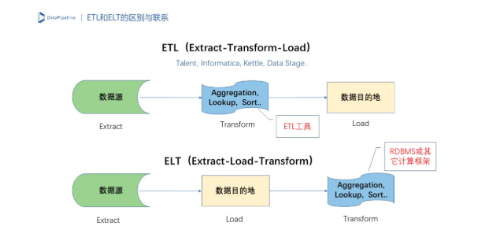

BI (Business Intelligence) 商业智能
------------------

## ETL Extract-Transform-Load
ETL是将业务系统的数据经过抽取(Extract)、清洗转换(Transform)之后加载(Load)到数据仓库（Data Warehouse）或数据集市（Data Mart）中，成为联机分析处理（On-Line Analytical Processing，OLAP）、数据挖掘（Data Mining）的基础。目的是将企业中的分散、零乱、标准不统一的数据整合到一起，为企业的决策提供分析依据。
> **抽取** 是将数据从已有的数据源中提取出来，例如通过 JDBC/Binlog 方式获取 MySQL 数据库的增量数据；**转换** 是对原始数据进行处理，例如将用户属性中的手机号替换为匿名的唯一 ID、计算每个用户对商品的平均打分、计算每个商品的购买数量、将 B 表的数据填充到 A 表中形成新的宽表等；**加载** 是将数据写入目的地。

* [Apache Camel](http://camel.apache.org/)
* [Apatar](http://apatar.com/)
* [Heka](http://hekad.readthedocs.io)
* [ElasticSearch](https://www.elastic.co/products/logstash)
* [Scriptella](http://scriptella.org/)
* [Talend](http://www.talend.com/)
* [Kettle](https://github.com/pentaho/pentaho-kettle)
* [Informatica](https://www.informatica.com/)
* [DataStage](https://www.ibm.com/products/infosphere-datastage)

## ELT
ELT 和 ETL 相比，ETL 在数据源抽取后首先进行转换，然后将转换的结果写入目的地。ELT 则是在抽取后将结果先写入目的地，然后由下游应用利用数据库的聚合分析能力或者外部计算框架，例如 Spark 来完成转换的步骤。最大的区别是“重抽取和加载，轻转换”，从而可以用更简单的技术栈、更轻量的方案搭建起一个满足现代企业应用的数据集成平台。AI 应用内在的特点也使得 ELT 特别适合这个场景。

* [Kafka](https://cwiki.apache.org/confluence/display/KAFKA/Ecosystem)
* [Kafka Connect](https://docs.confluent.io/current/connect/index.html)
* [DataX](https://github.com/alibaba/DataX)
* [DataPipeline](https://www.datapipeline.com/)

## [案例](https://mp.weixin.qq.com/s?__biz=MjM5ODI5Njc2MA==&mid=2655830097&idx=1&sn=a637be12d879ab6f43bc35a74cdc70c6)
设计要求在用户输入搜索内容时，要能从商家名称和商品名称两个维度去搜索，搜索出来的结果，按照准确率排序，并按商家所属商品的关联关系，来组合数据结构，同时提供 API 给业务系统调用。  
* 商家数据库和商品数据库是多台不同的服务器，并且数据量达百万级，如何才能实现跨数据库的数据同步呢？
* 商家和商品的数据是有从属关系的，不然就会把肯德基的香辣鸡腿堡挂到麦当劳去，这就尴尬了！
* 商家商品数据是经常更新的，比如修改价格、库存、上下架等，那搜索服务可不能搜出一堆过时的数据，如果客户明明搜出来的商品，点进去后却已下架了，那么客户就要吐槽了！如何实现搜索数据与源数据库增删改均实时同步呢？
### 架构设计
* 首先，商家数据和商品数据分别存储在 2 个独立的 MySQL8 数据库，为满足商家数据和商品数据的关联，我们需要将两个库中所需要的表实时 ETL 到我们的搜索系统数据库。
* 其次，数据从商家、商品数据库 ETL 到搜索系统数据库后，需要实时的组合成为商家关联商品数据结构，并以父子文档的格式，存储到 ES 中。
* 最后，商家、商品数据库的增删改操作，需要实时的同步到 ES 中，也就是 ES 中的数据，需要支持实时的增加、删除和修改。
* 为此，我们设计了 2 个 Canal 组件，第一个 Canal 实现数据 ETL，把商家、商品数据库的某些表及字段，抽取到搜索服务数据库。
* 再利用第二个 Canal，读取搜索服务 MySQL 数据库的 Binlog，实时传输到 Kafka 消息队列，再由 canal adapter 对数据进行关联、父子文档映射等，将处理好的数据存储到 ElasticSearch 中。

## BI商业软件
* [tableau](https://www.tableau.com/)
* [powerbi](http://www.powerbi.com.cn/)
* [powerbi microsoft](https://powerbi.microsoft.com/)
* [tempo](http://www.meritdata.com.cn/)
* [dataojo](https://www.dataojo.com/index.html)
* [DataWorks](https://www.aliyun.com/product/bigdata/ide)
