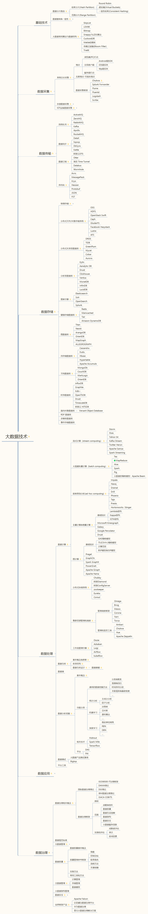
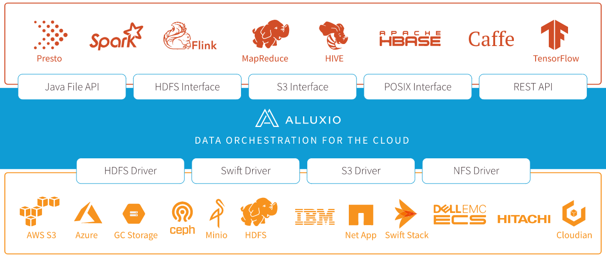

Big Data
--------------

[](https://www.processon.com/view/link/5ee2424be0b34d4dba347744)


## 涉及关键知识点
### 存储引擎

#### LSM
Log Structured Merge Tree 日志结构合并树
>  Apache HBase, Apache Cassandra, MongoDB(Wired Tiger), LevelDB , RocksDB 都使用 LSM 存储引擎

LSM 类存储引擎，将对数据的修改增量保存在内存中，达到指定大小限制之后批量把数据flush到磁盘中，磁盘中树定期可以做merge操作，合并成一棵大树，以优化写性能。因为数据是先写到内存中，所以为了防止内存数据丢失，会先把数据写入hlog中，也符合了数据库中标准，先写日志，再写数据。

> 不过读取的时候稍微麻烦一些，读取时看这些数据在内存中，如果未能命中内存，则需要访问较多的磁盘文件。极端的说，基于LSM树实现的存储引擎(如：hbase)写性能比`B+树`(如：mysql)高了一个数量级，读性能却低了一个数量级。


### 容错 数据冗余技术
#### 副本策略
Hadoop2.x 中使用了副本方案（Scheme）。存储开销200%  
如果有6个块，将有18个块占用空间
#### 纠删码 Erasure Code
Hadoop3.x 中使用Erasure编码处理容错。存储开销50%  
如果有6个块，将有9个块占用空间，6块block，3块用于奇偶校验。

[Erasure Coding Library](http://jerasure.org/)

#### 磁盘阵列
RAID，Redundant Arrays of Independent Disks，独立磁盘构成的具有冗余能力的阵列

## 生态系统

* Hadoop
* HBase
* MapReduce
* Pig
  > 脚本方式去描述MapReduce

* Hive
  > SQL方式去描述MapReduce

* Impala，Presto，Drill
  > 轻量级MapReduce

* Hive on Tez, Spark, SparkSQL
* Ambari 集群管理
* Sqoop
  > SQL to Hadoop 用于在不同存储系统之间实现数据导入导出

* Cassandra
* Druid, ClickHouse
* Flink
* Kafka
* MPP (Massively Parallel Processing) 大规模并行处理
* Ranger, Kerberos, Knox 安全鉴权
* Alluxio
  > 为数据驱动型应用和存储系统构建了桥梁, 将数据从存储层移动到距离数据驱动型应用更近的位置从而能够更容易被访问

* Hudi
  > 使得您能在hadoop兼容的存储之上存储大量数据，同时它还提供两种流原语(插入更新,增量拉取)，使得除了经典的批处理之外，还可以在数据湖上进行流处理

* Altas
  > [元数据](https://mp.weixin.qq.com/s/0-k5PYkUCU1HCZCBPIWiAw)


### Hadoop
#### HDFS
分布式文件系统

* NameNode
* DataNode

#### YARN
集群资源管理器

* ResourceManager
* NodeManager

#### MapReduce
批处理框架

### Zookeeper
> 应用于大数据开发中的，统一命名服务、统一配置管理、统一集群管理、服务器节点动态上下线、软负载均衡等场景

* Znode
  * 持久节点
  * 临时节点
  * 有序节点

### HBase
基于 Google 的 BigTable 论文，基于 HDFS 的面向列的数据库

* HMaster
* HRegionServer
  * HLog
  * HRegion
    * Store


### Apache Atlas
[Apache Atlas](http://atlas.apache.org/) , Hadoop的数据治理和元数据框架。它为Hadoop集群提供了包括 数据分类、集中策略引擎、数据血缘、安全和生命周期管理在内的元数据治理核心能力。

* 数据分类
  - 为元数据导入或定义业务导向的分类注释
  - 定义，注释，以及自动捕获数据集和底层元素之间的关系
  - 导出元数据到第三方系统
* 集中审计
  - 捕获与所有应用，过程以及与数据交互的安全访问信息
  - 捕获执行，步骤，活动等操作的信息
* 搜索与血缘
  - 预定义的导航路径用来探索数据分类以及审计信息
  - 基于文本的搜索特性来快速和准确的定位相关联的数据和审计事件
  - 对数据集血缘关系的可视化浏览使用户可以下钻到操作，安全以及数据起源相关的信息
* 安全与策略引擎
  - 基于数据分类模式，属性以及角色的运行时合理合规策略
  - 基于分类-预测的高级策略定义以防止数据推导
  - 基于cell的属性和值的行/列级别的masking

#### 架构
[](http://atlas.apache.org/#/Architecture)

##### Core
* Ingest / Export  
  Ingest 组件允许将元数据添加到 Atlas, Export 组件暴露由 Atlas 检测到的元数据更改，以作为事件引发，消费者可以使用这些更改事件来实时响应元数据更改。

* Type System  
  Atlas 允许用户为他们想要管理的元数据对象定义一个模型。该模型由称为 "类型" 的定义组成。"类型" 的 实例被称为 "实体" 表示被管理的实际元数据对象。类型系统是一个组件，允许用户定义和管理类型和实体。由 Atlas 管理的所有元数据对象（例如Hive表）都使用类型进行建模，并表示为实体。要在 Atlas 中存储新类型的元数据，需要了解类型系统组件的概念。
  > 例如：Atlas 本身自带的 hive_table 类
  ```
Name:         hive_table
TypeCategory: Entity
SuperTypes:   DataSet
Attributes:
    name:             string
    db:               hive_db
    owner:            string
    createTime:       date
    lastAccessTime:   date
    comment:          string
    retention:        int
    sd:               hive_storagedesc
    partitionKeys:    array<hive_column>
    aliases:          array<string>
    columns:          array<hive_column>
    parameters:       map<string>
    viewOriginalText: string
    viewExpandedText: string
    tableType:        string
    temporary:        boolean
```
```json
guid:     "9ba387dd-fa76-429c-b791-ffc338d3c91f"
typeName: "hive_table"
status:   "ACTIVE"
values:
    name:             “customers”
    db:               { "guid": "b42c6cfc-c1e7-42fd-a9e6-890e0adf33bc",
                        "typeName": "hive_db"
                      }
    owner:            “admin”
    createTime:       1490761686029
    updateTime:       1516298102877
    comment:          null
    retention:        0
    sd:               { "guid": "ff58025f-6854-4195-9f75-3a3058dd8dcf",
                        "typeName":
                        "hive_storagedesc"
                      }
    partitionKeys:    null
    aliases:          null
    columns:          [ { "guid": "65e2204f-6a23-4130-934a-9679af6a211f",
                          "typeName": "hive_column" },
                        { "guid": "d726de70-faca-46fb-9c99-cf04f6b579a6",
                          "typeName": "hive_column" },
                          ...
                      ]
    parameters:       { "transient_lastDdlTime": "1466403208"}
    viewOriginalText: null
    viewExpandedText: null
    tableType:        “MANAGED_TABLE”
    temporary:        false
```
实体类型的每个实例都由唯一标识符 GUID 标识。
定义对象时，此 GUID 由 Atlas 服务器生成，并且在实体的整个生命周期内保持不变。在任何时间点，都可以使用其 GUID 访问此特定实体。

* Graph Engine  
  在内部，Atlas 持久化它使用图形模型管理的元数据对象。 这种方法提供了极大的灵活性，并支持高效地处理元数据对象之间的丰富关系。 图形引擎组件负责在 Atlas 类型系统和底层图形持久化模型的类型和实体之间进行转换。 除了管理图对象之外，图引擎还为元数据对象创建适当的索引，以便有效地搜索它们。 Atlas 使用 JanusGraph 来存储元数据对象。

##### Integration
* API  
  Atlas 的所有功能都通过 REST API 向最终用户公开，该 API 允许创建、更新和删除类型和实体。 它也是查询和发现 Atlas 管理的类型和实体的主要机制。

* Messaging  
  除了 API 之外，用户还可以选择使用基于 Kafka 的消息传递界面与 Atlas 集成。 这对于与 Atlas 通信元数据对象以及使用 Atlas 中可以构建应用程序的元数据更改事件都很有用。 如果希望使用与 Atlas 更松散耦合的集成，从而实现更好的可伸缩性、可靠性等，则消息传递界面尤其有用。 Atlas 使用 apache kafka 作为元数据通知事件的钩子和下游消费者之间的通信通知服务器。 事件是由 hook 和 Atlas 写到不同的 Kafka topics。
  * ATLAS_HOOK: 来自 各个组件的Hook 的元数据通知事件通过写入到名为 ATLAS_HOOK 的 Kafka topic 发送到 Atlas
  * ATLAS_ENTITIES：从 Atlas 到其他集成组件（如Ranger）的事件写入到名为 ATLAS_ENTITIES 的 Kafka topic

##### Metadata source
Atlas 支持集成多种源的元数据开箱即用
- [HBase](http://atlas.apache.org/#/HookHBase)
- [Hive](http://atlas.apache.org/#/HookHive)
- [Sqoop](http://atlas.apache.org/#/HookSqoop)
- [Storm](http://atlas.apache.org/#/HookStorm)
- [Kafka](http://atlas.apache.org/#/HookKafka)

元数据源需要实现以下两点:  
首先，需要基于 atlas 的类型系统定义能够表达大数据组件元数据对象的元数据模型(例如 Hive 的元数据模型实现在 `org.apache.atlas.hive.model.HiveDataModelGenerator`；
然后，需要提供 hook 组件去从大数据组件的元数据源中提取元数据对象，实时侦听元数据的变更并反馈给
atlas；

##### Apps
* Admin UI  
  这个组件是一个基于 web 的应用程序，允许数据管理员和科学家发现和注释元数据。 这里最重要的是一个搜索界面和类似 SQL 的查询语言，可用于查询 Atlas 管理的元数据类型和对象。 Admin UI 使用 Atlas 的 REST API 来构建其功能。

* Ranger Tag Based Policies
  Apache Ranger 是 Hadoop 生态系统的高级安全管理解决方案，与各种 Hadoop 组件进行了广泛的集成。 通过与 Atlas 集成，Ranger 允许安全管理员定义元数据驱动的安全策略，以实现有效的治理。 Ranger 是 Atlas 通知的元数据更改事件的使用者。


### 数据湖 Data lake
数据湖是一个以 **原始格式(通常是对象块或文件，数据不做预处理，保存数据的原始状态)存储数据的系统或存储库**。数据湖通常是所有企业数据的单一存储（存储库中会汇总多种数据源，是一个单一库）。用于报告、可视化、高级分析和机器学习等任务。数据湖可以包括来自 **关系数据库的结构化数据**(行和列)、**半结构化数据**(CSV、日志、XML、JSON)、**非结构化数据**(电子邮件、文档、pdf)和 **二进制数据**(图像、音频、视频)。

> 大数据刚兴起的时候，数据主要用途是 BI 、报表、可视化。因此数据需要是结构化的，并且需要 ETL 对数据进行预处理。这个阶段数据仓库更适合完成这样的需求，所以企业大部分需要分析的数据都集中到数据仓库中。而机器学习的兴起对数据的需求更加灵活，如果从数据仓库中提数会有一些问题。比如：数据都是结构化的；数据是经过处理的可能并不是算法想要的结果；算法同学与数仓开发同学沟通成本较大等。我在工作中就遇到这种情况，做算法的同学需要经常理解我们的数仓模型，甚至要深入到做了什么业务处理，并且我们的处理可能并不是他们的想要的。基于上面遇到的各种问题，数据湖的概念应运而生。下面的表格对比一下数据湖和数据仓库的区别，主要来自 AWS 。

> Hudi是一个用于构建数据湖的开源工具。在GitHub是很活跃的。我们构建数仓很多时候会选Hive。而构建数据湖我们可以选择Hudi。它提供了数据湖所必要的数据提取、数据管理、血缘追踪等功能，而且可以Hadoop、Spark等大数据框架很好地结合起来。

> [优秀文章](https://mp.weixin.qq.com/s/2VQQo2y5OWHIAmelmJVD2Q)

|特性|数据仓库|数据湖|
|-----|-----|----|
|数据|经过预处理的结构化关系数据|来自IoT设备、网站、移动应用程序、社交媒体、企业应用的非关系型和关系型数据|
Schema|设计在数据仓库之前，写入型 Schema | 分析的时候临时建立 scheam 和表，用 SQL分析， 读取型 schema|

* Data Lake Analytics Aliyun
> 通过标准JDBC直接对阿里云OSS，TableStore，RDS，MongoDB等不同数据源中存储的数据进行查询和分析。DLA 无缝集成各类商业分析工具，提供便捷的数据可视化。阿里云OSS 可以存储各种结构化、半结构化、非结构化的数据，可以当做一个数据湖的存储库。DLA 使用前需要创建 Schema 、定义表，再进行后续分析。

* Lake Formation AWS
> 可以识别 S3 或关系数据库和 NoSQL 数据库中存储的现有数据，并将数据移动到 S3 数据湖中。使用 EMR for Apache Spark（测试版）、Redshift 或 Athena 进行分析。支持的数据源跟阿里云差不多。


工业数据空间（Industrial Data Space）
--------------
