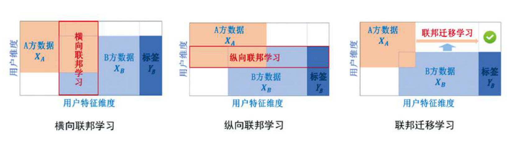
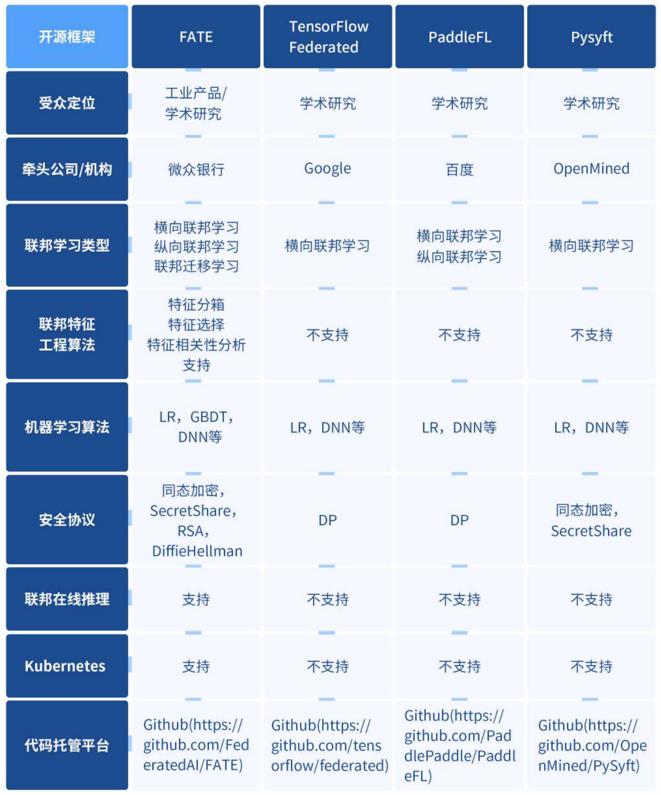

联邦学习（Federated Learning）
-----------
在进行机器学习的过程中，各参与方可借助其他方数据进行联合建模。各方无需共享数据资源，即数据不出本地的情况下，进行数据联合训练，建立共享的机器学习模型。

* 各方数据都保留在本地，不泄露隐私也不违反法规。
* 多个参与者联合数据建立虚拟的共有模型，并且共同获益的体系
* 在联邦学习的体系下，各个参与者的身份和地位平等
* 联邦学习的建模效果和将整个数据集放在一处建模的效果相同，或相差不大
  > 在各个数据的用户 user alignment 或 特征 feature alignment 对齐的条件下

* 迁移学习是在用户或特征不对齐的情况下，也可以在数据间通过交换加密参数达到知识迁移的效果
* 联邦学习使多个参与方在保护数据隐私、满足合法合规要求的前提下继续进行机器学习，解决数据孤岛问题
* 带动跨领域的企业级数据合作，催生基于联合建模的新业态和模式，降低技术提升成本和促进创新技术发展

## 联邦学习与差分隐私理论
联邦学习的特点使其可以被用来保护用户数据的隐私，但是他和大数据、数据挖掘领域中常用的隐私保护理论如差分隐私保护理论 Differential Privacy 、K匿名 K-Anonymity 和 l多样化 l-Diversity 等方法还是有较大差别的。首先联邦学习与传统隐私保护法的原理不同，联邦学习通过加密机制下的参数交换方式保护用户数据隐私，加密手段包括同态加密等。与 Differential Privacy 不同，其数据和模型本事不会进行传输，因此在数据层面上不存在泄露的可能，也不违法更严格的数据保护法方案，如GDPR（欧盟 2018 年正式施行的法案《通用数据保护条例》General Data Protection Regulation）等。而差分隐私保护理论、K匿名 和 l多样化等方法是通过在数据里加噪音，或采用概括化的方法模糊某些敏感属性，直到第三方不能区分个体为止，从而以较高的概率使数据无法还原，以此来保护用户隐私。但是，从本质上来说这些方法还是进行了原始数据的传输，存在着潜在被攻击的可能性，并且在 GDPR 等更严格的数据保护法案下这种数据隐私的保护方式可能不再适用。与之对应的联邦学习是对用户数据隐私保护更为有力的手段。

## 联邦学习与分布式机器学习
横向联邦学习中多方联合训练的方式与分布式机器学习 Distributed Machine Learning 有部分相似的地方。分布式机器学习涵盖了多个方面，包括把机器学习中的训练数据分布式存储、计算任务分布式运行、模型结果分布式发布等，参数服务器 Parameter Server 是分布式机器学习中一个典型的例子。参数服务器作为加速机器学习模型训练过程的一种工具，他将数据存储在分布式的工作节点上，通过一个中心式的调度节点调配数据分布和分配计算资源，以便更高效的获得最终的训练模型。而对于联邦学习而言，首先在于横向联邦学习中的工作节点代表的是模型训练的数据拥有方，其对本地的数据具有完全的自治权限，可以自主决定何时加入联邦学习进行建模，相对地在参数服务器中，中心节点始终占据着主导地位，因此联邦学习面对的是一个更复杂的学习环境；其次，联邦学习则强调模型训练过程中对数据拥有方的数据隐私保护，是一种应对数据隐私保护的有效措施，能更好地应对未来愈加严格的数据隐私和数据安全监管环境。

## 联邦学习与联邦数据库
## 联邦学习与区块链技术
区块链是一个机遇密码学安全的分布式账本，其方便验证，不可篡改。区块链2.0是一个去中心化的应用，通过使用开源的代码及分布式的存储和运行，保证极高的透明度和安全性，使数据不会被篡改。区块链的经典应用包括比特币、以太坊等。区块链与联邦学习都是一种去中心化的网络，区块链是一种安全P2P(peer to peer) 的网络结构，在联邦学习中，第三方会承担汇聚模型、管理等功能。联邦学习与区块链中，均有涉及到密码学、加密算法等基础技术。  
* 根据技术的不同，区块链技术使用的加密算法包括哈希算法，非对称加密等；联邦学习中使用同态加密等。  
* 从数据角度上看，区块链上通过加密的方式在各节点上记录了完整的数据，而联邦学习中，各方的数据均仅保留在本地。  
* 从奖励机制上看，区块链中，不同阶段之间通过竞争记账来获取奖励；在联邦学习中，多个参与方通过共同学习，提高模型训练结果，依据每一方的贡献来分配奖励。

## 联邦学习与多方安全计算
在联邦学习中，用户的隐私与安全是重中之重。为了保护用户隐私，防止联邦学习应用被恶意方攻击，多方安全计算技术可以在联邦学习中被应用，成为联邦学习技术框架中的一部分。学术界已经展开利用多方安全计算来增强联邦学习的安全性的研究。McMahan 指出，联邦学习可以通过差分隐私，多方安全计算，或它们的结合等技术来提供更强的安全保障。 Bonawitz 指出，联邦学习中，可以利用多方安全计算以安全的方式计算来自用户设备的模型参数更新的总和。 Truex 中提出了一种利用差分隐私和多方安全计算来保护隐私的联邦学习方法。Liu 提出将加性同态加密(AHE)应用与神经网络的多方计算。

## 联邦学习分类
针对不同数据集，联邦学习分为横向联邦学习（horizontal federated learning）、纵向联邦学习（vertical federated learning）与联邦迁移学习（Federated Transfer Learning，FmL）。

* **横向联邦学习在两个数据集的用户特征重叠较多，而用户重叠较少的情况下**，我们把数据集按照横向（即用户维度）切分，并取出双方用户特征相同而用户不完全相同的那部分数据进行训练。这种方法叫做横向联邦学习。比如有两家不同地区的银行，它们的用户群体分别来自各自所在的地区，相互的交集很小。但是，它们的业务很相似，因此，记录的用户特征是相同的。此时，我们就可以使用横向联邦学习来构建联合模型。谷歌在2016年提出了一个针对安卓手机模型更新的数据联合建模方案：在单个用户使用安卓手机时，不断在本地更新模型参数并将参数上传到安卓云上，从而使特征维度相同的各数据拥有方建立联合模型。

* **纵向联邦学习在两个数据集的用户重叠较多而用户特征重叠较少的情况下**，我们把数据集按照纵向（即特征维度）切分，并取出双方用户相同而用户特征不完全相同的那部分数据进行训练。这种方法叫做纵向联邦学习。比如有两个不同的机构，家是某地的银行，另一家是同一个地方的电商。它们的用户群体很有可能包含该地的大部分居民因此用户的交集较大。但是，由于银行记录的都是用户的收支行为与信用评级，而电商则保有用户的浏览与购买历史，因此它们的用户特征交集较小。纵向联邦学习就是将这些不同特征在加密的状态下加以聚合，以增强模型能力。目前，逻辑回归模型、树形结构模型和神经网络模型等众多机器学习模型已经逐渐被证实能够建立在此联邦体系上。

* **联邦迁移学习在两个数据集的用户与用户特征重叠都较少的情况下**，我们不对数据进行切分，而利用迁移学习国来克服数据或标签不足的情况。这种方法叫做联邦迁移学习。比如有两个不同机构，一家是位于中国的银行，另一家是位于美国的电商。由于受地域限制，这两家机构的用户群体交集很小。同时，由于机构类型的不同，二者的数据特征也只有小部分重合。在这种情况下，要想进行有效的联邦学习，就必须引入迁移学习，来解决单边数据规模小和标签样本少的问题，从而提升模型的效果。

## 联邦学习开源框架
* FATE。 微众银行
* Pysyft。 OpenMinded
* TensorFlow Federated。 Google
* PaddleFL。 百度

## 参考
https://www.fedai.org/
