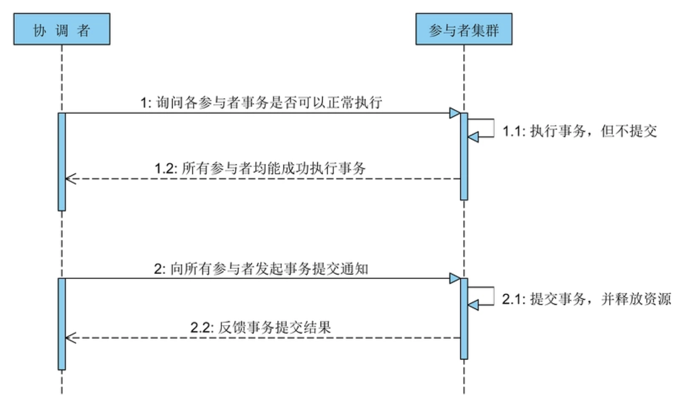
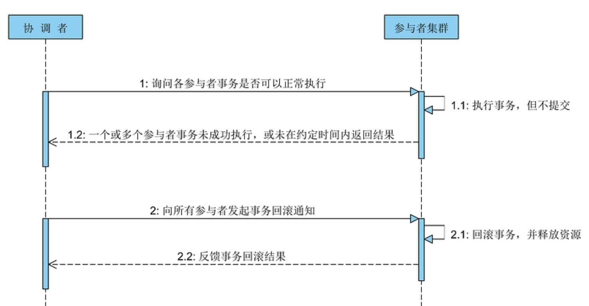
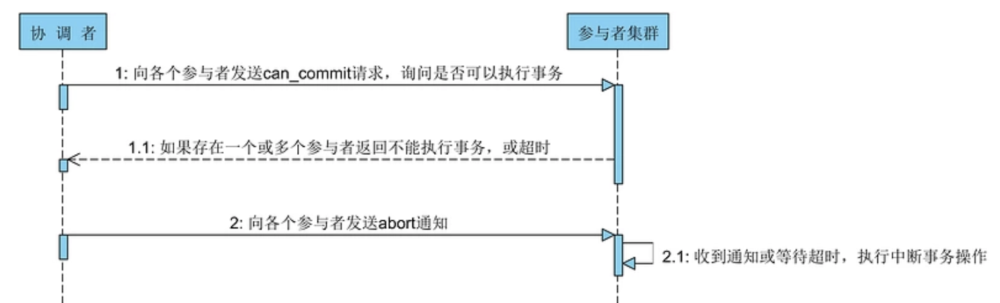
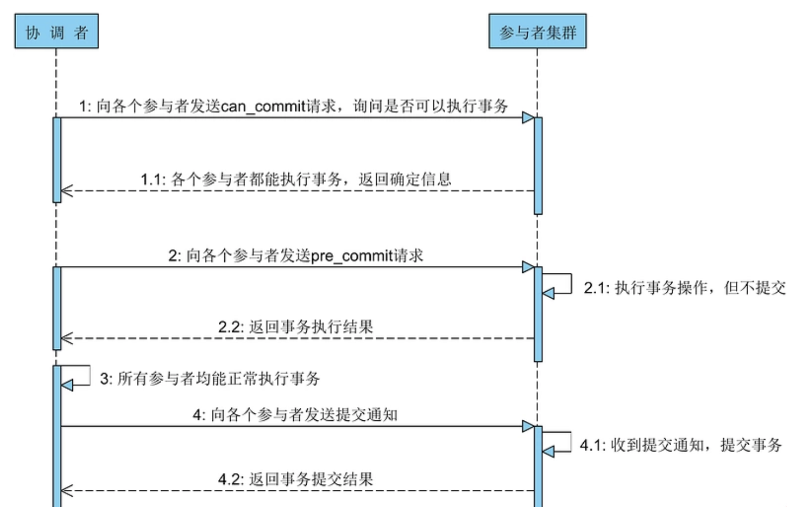
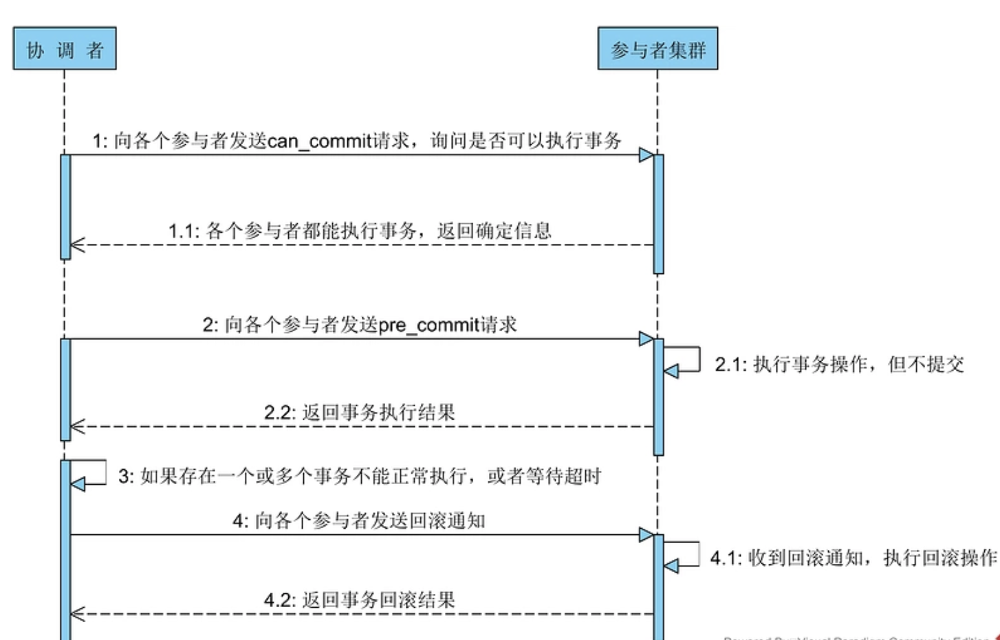
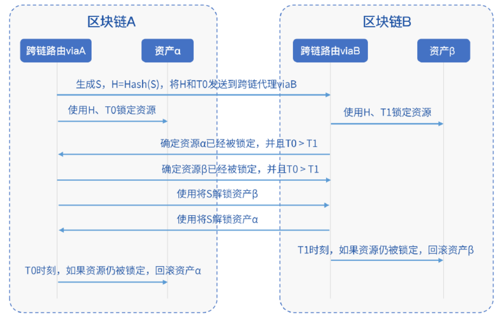
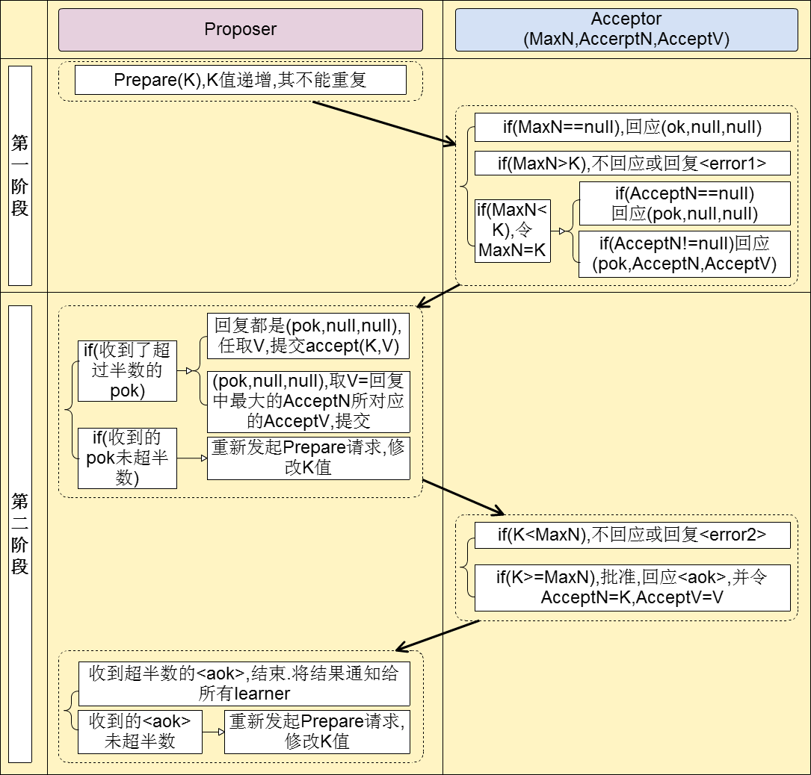

分布式系统数据一致性
--------------
分布式系统中存在 CAP 问题
一致性（ C onsistency）、可用性（ A vailability），以及分区容错性（ P artition Tolerance）

## 分布式系统
### 两阶段提交协议（2PC：Two-Phase Commit）
该协议存在一个 **协调者** 单点，与多个 **参与者** 节点

#### 第一阶段：投票
该阶段的主要目的在于打探数据库集群中的各个参与者是否能够正常的执行事务，具体步骤如下：
* 协调者向所有的参与者发送事务执行请求，并等待参与者反馈事务执行结果；
* 事务参与者收到请求之后，执行事务但不提交，并记录事务日志；
* 参与者将自己事务执行情况反馈给协调者，同时阻塞等待协调者的后续指令。

#### 第二阶段：事务提交
在经过第一阶段协调者的询盘之后，各个参与者会回复自己事务的执行情况，这时候存在 3 种可能性：
1. 所有的参与者都回复能够正常执行事务。

2. 一个或多个参与者回复事务执行失败。
3. 协调者等待超时。

#### 缺点与存在的问题
* 同步阻塞问题
  > 执行过程中，所有参与节点都是事务阻塞型的。当参与者占有公共资源时，其他第三方节点访问公共资源不得不处于阻塞状态

* 单点故障
  > 由于协调者的重要性，一旦协调者发生故障。参与者会一直阻塞下去。尤其在第二阶段，协调者发生故障，那么所有的参与者还都处于锁定事务资源的状态中，而无法继续完成事务操作。（如果是协调者挂掉，可以重新选举一个协调者，但是无法解决因为协调者宕机导致的参与者处于阻塞状态的问题）

* 数据不一致
  > 在阶段二中，当协调者向参与者发送commit请求之后，发生了局部网络异常或者在发送commit请求过程中协调者发生了故障，这回导致只有一部分参与者接受到了commit请求。而在这部分参与者接到commit请求之后就会执行commit操作。但是其他部分未接到commit请求的机器则无法执行事务提交。于是整个分布式系统便出现了数据部一致性的现象。

针对上述问题可以引入 **超时机制** 和 **互询机制** 在很大程度上予以解决。

对于协调者来说如果在指定时间内没有收到所有参与者的应答，则可以自动退出 WAIT 状态，并向所有参与者发送 rollback 通知。对于参与者来说如果位于 READY 状态，但是在指定时间内没有收到协调者的第二阶段通知，则不能武断地执行 rollback 操作，因为协调者可能发送的是 commit 通知，这个时候执行 rollback 就会导致数据不一致。

此时，我们可以介入互询机制，让参与者 A 去询问其他参与者 B 的执行情况。如果 B 执行了 rollback 或 commit 操作，则 A 可以大胆的与 B 执行相同的操作；如果 B 此时还没有到达 READY 状态，则可以推断出协调者发出的肯定是 rollback 通知；如果 B 同样位于 READY 状态，则 A 可以继续询问另外的参与者。只有当所有的参与者都位于 READY 状态时，此时两阶段提交协议无法处理，将陷入长时间的阻塞状态。

### 三阶段提交协议（3PC：Three-Phase Commit）
针对两阶段提交存在的问题，三阶段提交协议通过引入一个 预询盘 阶段，以及超时策略来减少整个集群的阻塞时间，提升系统性能

#### 第一阶段：预询盘
该阶段协调者会去询问各个参与者是否能够正常执行事务，参与者根据自身情况回复一个预估值，相对于真正的执行事务，这个过程是轻量的，具体步骤如下：
* 协调者向各个参与者发送事务询问通知，询问是否可以执行事务操作，并等待回复；
* 各个参与者依据自身状况回复一个预估值，如果预估自己能够正常执行事务就返回确定信息，并进入预备状态，否则返回否定信息。

#### 第二阶段：预提交
本阶段协调者会根据第一阶段的询盘结果采取相应操作，询盘结果主要有 3 种：
1. 所有的参与者都返回确定信息。
  > 继续进入第三阶段
2. 一个或多个参与者返回否定信息。
3. 协调者等待超时。

#### 第三阶段：事务提交
如果第二阶段事务未中断，那么本阶段协调者将会依据事务执行返回的结果来决定提交或回滚事务，分为 3 种情况：
1. 所有的参与者都能正常执行事务。

2. 一个或多个参与者执行事务失败。
3. 协调者等待超时。

虽然 3PC 对数据强一致性更有保障，但基于效率问题，2PC在各大分布式系统中使用更广泛。

## 区块链分布式系统
### 哈希时间锁定
哈希时间锁定合约 HTLC（Hash TimeLock Contract）

[FISCO BCOS WeCross HTLC](https://github.com/JimmyShi22/WeCross/blob/ca56c8a3d432b48dc9bc69f400240964abaf9211/src/main/resources/chains-sample/bcos/htlc/HTLC.sol)

哈希时间锁定合约的处理流程基于哈希算法和超时机制，假设有两个区块链 A 和 B，试图交换位于链 A 的资产 α 和位于链 B 的资产 β，则整个哈希时间锁定的流程如下：
* A 首先选取一个秘密随机数 S，使用特定的哈希算法计算出 S 的哈希值 H，之后 A 将 H 发给 B，同时 A 和 B 协商两个时间点 T0 和 T1，确保 T0 >T1。
* A 基于 H 和 T0 创建资产锁定智能合约 LockContractA，该智能合约会锁定资产 α，其可以使用 S 来解锁并将资产 α 转移给 B，如果在 T0 前仍未解锁，则会自动撤销锁
定，且不会发生任何资产转移。
* B 基于 H 和 T1 创建资产锁定智能合约 LockContractB，该智能合约会锁定资产 β，其可以使用 S 来解锁并将资产 β 转移给 A，如果在 T1 前仍未解锁，则会自动撤销锁
定，且不会发生任何资产转移。
* A 使用秘密随机数 S，调用 B 上的智能合约 LockContractB，将资产 β 转移给 A 。
* 经过上述步骤，B 获得了秘密随机数 S，B 使用 S 调用 A 上的智能合约 LockContractA，将资产 α 转移给 B，资产交换完成。
* 如果 A 或 B 任意一方超时未执行操作，则在 T1 时间点后，B 资产会撤销锁定，T0时间点后，A 资产会撤销锁定，还原初始状态。
* T0 和 T1 用于避免 A 或 B 单方延误交易，所以这其中的交易包 α 和交易包 β 都需要设定时间限制，超出这个时间限制后，相关资产立即撤销锁定，原路返回。整体操作时序流程
如下图所示。

// TODO 延伸知识：比特币闪电网络，RSMC，跨链

### Paxos

> 准确的说 Paxos 并不非**一致性算法**，它应该属于**共识算法**。一致性（consistency）和共识（consensus）并不是同一个概念

#### 角色
* proposers 提出提案，提案信息包括提案编号和提议
* acceptor 收到提案后可以接受提案

#### 第一阶段：Prepare阶段

A把申请修改的请求Prepare Request发给所有的结点A，B，C。注意，Paxos算法会有一个Sequence Number（你可以认为是一个提案号，这个数不断递增，而且是唯一的，也就是说A和B不可能有相同的提案号），这个提案号会和修改请求一同发出，任何结点在“Prepare阶段”时都会拒绝其值小于当前提案号的请求。所以，结点A在向所有结点申请修改请求的时候，需要带一个提案号，越新的提案，这个提案号就越是是最大的。

如果接收结点收到的提案号n大于其它结点发过来的提案号，这个结点会回应Yes（本结点上最新的被批准提案号），并保证不接收其它<n的提案。这样一来，结点上在Prepare阶段里总是会对最新的提案做承诺。

优化：在上述 prepare 过程中，如果任何一个结点发现存在一个更高编号的提案，则需要通知 提案人，提醒其中断这次提案。

#### 第二阶段：Accept阶段

如果提案者A收到了超过半数的结点返回的Yes，然后他就会向所有的结点发布Accept Request（同样，需要带上提案号n），如果没有超过半数的话，那就返回失败。

当结点们收到了Accept Request后，如果对于接收的结点来说，n是最大的了，那么，它就会修改这个值，如果发现自己有一个更大的提案号，那么，结点就会拒绝修改。
