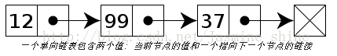
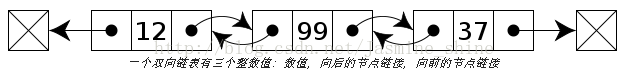
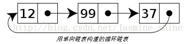

# 复习大纲

## 基础

### JDK和JRE

### 跨平台原理

### 数据类型

- 8种基本数据类型
	- byte
		- 1字节
	- short
		- 2字节
	- char
		- 2字节
	- int
		- 4字节
	- long
		- 8字节
	- float
		- 4字节
	- double
		- 8字节
	- boolean
		- 1字节

- 装箱和拆箱
	- 装箱:int->integer
	- 拆箱:integer->int

- 自动类型转换
	- 转换原则：从低精度向高精度转换byte->(short、char)->int->long->float->double
	- 两个char型运算时，自动转换为int型；
当char与别的类型运算时，也会先自动转换为int型的，
再做其它类型的自动转换

###  java 中的 Math.round(-1.5) 等于多少
- +0.5再做四舍五入

### java特性
- 封装
	- 是隐藏对象的属性和实现细节,仅对外提供公共访问方式
- 继承
- 多态
	- 编译时多态通过方法重载
		- 重载只能通过不同的方法参数区分
			- 参数个数不同
			- 参数类型不同
		- 通过指向父类的指针，来调用在不同子类中实现的方法
	- 运行时多态通过方法重写

### 多态用到了动态绑定
- 编译时类型与运行时类型不一致就会发生运行时动态绑定（典型的就是重载）

### 向上转型与向下转型
- 上转型：是子类对象由父类引用，格式：parent p=new son
- 下转型：是父类向下强制转换到子类对象
- 前提是该父类对象必须是经过上转型的对象
	- //对进行过上转型的对象，进行强制下转型
21         Son s=(Son)p;

### java元注解

- 能注解到注解上的注解，能用在其他注解上的注解
- 自定义注解：https://www.cnblogs.com/yanze/p/9296237.html

### java注解

- 注解的本质就是一个继承了 Annotation 接口的接口
- 解析一个类或者方法
的注解往往有两种形式

	- 一种是编译期直接的扫描
	- 一种是运行期反射

### ==和equals

- &nbsp;一个Integer只有在与 int比较，会先将Integer转换成int类型，
再做值比较，所以返回的是true，integer 类型变量缓存-128到127
- ==

	- 基本类型：比较的是值是否相同
引用类型：比较的是引用是否相同

- equals

	- equals 本质上就是 ==，但重写了string和integer，把引用比较改成了值比较

- equals和hashcode有什么关系

### String StringBuffer StringBuilder

- stringBuffer是线程安全
- String s = new String(“zsx”);

	- 创建了2个String对象和一个引用。

- String+是StringBuffer的append()方法来实现的

### 抽象类和接口区别

- 一个类只可以继承一个抽象类，但可以实现多个接口
- 抽象类可以有构造方法，接口中不能有构造方法
- 抽象类可以有普通的成员变量，接口中不能有普通的成员变量
- 抽象类中可以包含静态方法，接口中不能包含静态方法

### 泛型和类型擦除

- 参数化类型
- 写一个泛型类与普通类的区别是在类名后面加个<T>

### 反射

- class.forname

	- 是运用反射的原理创建对象

- private修饰的方法与变量能否反射（不能）
- 在 Java 的反射中，
Class.forName 和 ClassLoader 的区别

	- classloader值是将类的.class文件加载到jvm中，<br>不会执行static代码块<br>
	- class.forName不但将类的.class文件加载到jvm中，
还会执行static代码块

- classloader

	- 类加载器分类

		- 启动类加载器

			- 加载 Java 的核心库

		- 扩展类加载器

			- 加载 Java 的扩展库

		- 应用程序类加载器

			- 加载Java 应用的类

- 作用

	- 在运行时创建对象
	- 获取任意一个类所具有的成员变量和方法
	- 判断一个对象所属的类
	- 调用一个对象的任意方法

### 序列化

- 对象中被static或transient修饰的变量，在序列化时不被保存

### 动态代理

- 加事务
- 加日志
- 加权限
- spring AOP
- 想给一个类加一些额外的方法，可以对proxy代理类（中间类）添加一些额外的方法

### 克隆

- 浅克隆

	- 浅克隆不会克隆原对象中的引用类型，仅仅拷贝了引用类型的指向

- 深克隆

	- 深克隆的实现就是在引用类型所在的类实现Cloneable接口，
并使用public访问修饰符重写clone方法。

### 关键字

- throw和throws
- final、finally、finalize
- try、catch、finally
- Exception和Error
- switch支持的数据类型（java8）

	- byte、short、int 、char及其包装类型和string

### DOM和SAX解析xml的不同

- dom是基于内存的，把xml读到内存中，消耗很大的内存空间；
SAX是基于事件驱动的方式，事件被触发时，获取相应的xml数据解析
- dom可以向xml插入数据，SAX不可以
- dom可以随机访问，SAX不可以

### Java包装类的缓存

- 具体的实现方式为在类中预先创建频繁使用的包装类对象，当需要使用某个包装类的对象
时，如果该对象封装的值在缓存的范围内，就返回缓存的对象，否则创建新的对象并返回
- 哪些包装类没有缓存

	- float、double

### BIO、NIO、AIO

- NIO原理

	- 缓冲区buffer
	- 通道channel
	- 选择器select、poll、epoll

		- select和poll具有O(n)的无差别轮询复杂度
		- epoll事件复杂度为O(1),基于时间驱动的

### io

- 字节流

	- 按字节读，可用于文件、图片、视频、音频

- 字符流

	- 按照字符读，一般用于文件

### 异常

- &nbsp;runtimeException

	- 出现这类异常的时候程序会由虚拟机接管

- checkedException

	- 主要是指IO异常、SQL异常等。对于这种异常，
JVM要求我们必须对其进行cathc处理

### #字节码的结构

- 魔数
- 副版本号
- 主版本号
- 常量池
- 类索引
- 访问标志
- 方法集合
- 方法计数器

### Enum类中为什么
构造函数必须是私有的

- 了保证每一个枚举类元素的唯一实例，<br>是不会允许外部进行new的<br>

### sort排序原理

- 使用了两种排序方法，快速排序和优化的归并排序
- 快速排序主要是对那些基本类型数据排序，
 而归并排序用于对Object类型进行排序。

### 面向接口编程的好处

- 接口本质上就是由制定者来协调实现者和调用者之间的关系
- 设计模式的原则里的开闭原则，
其实就是要使用接口来实现对扩展开放，对修改关闭
- 子主题

## 容器

### List

- ArrayList

	- 默认大小是10，每次1.5倍

- stack
- vector
- LinkedList

### CopyonWriteArrayList和CopyOnWriteArraySet

- 原理：读写分离，读支持高并发，写需要加锁
- 问题

	- 内存占用
	- 数据一致性问题，支持最终一致性，不支持实时一致性

### Set

- hashset
- treeset

	- TreeSet可以确保集合元素处于排序状态

### map

- HashMap

	- HashMap1.7为什么使用的是头插法，1.8后使用尾插法，这个改变有什么作用吗
	- jdk8之前hashmap这种插入方法在并发场景下如果多个线程同时扩容会出现循环列表
	- HashMap在jdk1.8之后引入了红黑树的概念，
表示若桶中链表元素超过8时，会自动转化成红黑树；
若桶中元素小于等于6时，树结构还原成链表形式。

		- 选择6和8的原因

			- 中间有个差值7可以防止链表和树之间频繁的转换

	- 不安全主要发生在扩容时，容易产生循环链表

- TreeMap
- HashTable
- LinkedHashMap
- ConcurrentHashMap

	- 1.7与1.8的区别

		- 1.8使用Unsafe类的CAS自旋赋值+synchronized同步+
LockSupport阻塞等手段实现的高效并发

			- 采用头插法

### Iterator和ListIterator

- ListIterator有add()方法，可以向List中添加对象，而Iterator不能
-  iterator()方法在set和list接口中都有定义，ListIterator（）仅存在于list接口中（或实现类中）
- ListIterator有hasPrevious()和previous()方法，可以实现逆向（顺序向前）遍历
- ListIterator可以定位当前的索引位置，nextIndex()和previousIndex()可以实现。Iterator没有此功能

### queue

- PriorityQueue

### fail-fast机制

- 集合结构上发生了改变（.remove(i)）该机制将尽最大努力抛出异常

## jvm

### 组成及其作用

- 类加载器

	- 类加载过程

		- 加载：根据查找路径找到相应的 class 文件然后导入
		- 检查：检查加载的 class 文件的正确性；
		- 准备：给类中的静态变量分配内存空间；
		- 解析：虚拟机将常量池中的符号引用替换成直接引用的过程;
符号引用就理解为一个标示，而在直接引用直接指向内存中的地址；
		- 初始化：对静态变量和静态代码块执行初始化工作

	- 双亲委派
	- 类加载器分类

		- 启动类加载器

			- 加载 Java 的核心库

		- 扩展类加载器

			- 加载 Java 的扩展库

		- 应用程序类加载器

			- 加载Java 应用的类

- 运行时数据区
- 执行引擎
- 本地库接口

### 运行时数据区

- 程序计数器
- java虚拟机栈
- 本地方法栈
- 堆(年轻代:老年代=1:2)

	- 年轻代(8:1:1)

		- Eden区
		- from Survivor
		- to Survivor

	- 老年代

- 方法区（jdk1.8没了方法区，元数据空间）
- 线程共享的

	- 堆和方法区

### 引用类型

- 强

	- A a=new A()

- 软

	- 数据库查询缓存

- 弱
- 虚

### 一个对象的引用有多个，该如何判断它的可达性

- 单弱多强

### 判断一个对象是否可被回收

- 引用计数
- 可达性分析（哪些可作为GC root）

	- 虚拟机栈中引用的对象
	- 本地方法栈中引用的对象
	- 静态成员变量或者常量引用的对象

### 垃圾收集

- 垃圾收集器算法

	- 复制
	- 标记-整理
	- 标记-清除
	- 分代算法

- 垃圾收集器

	- 老年代回收器

		- CMS

			- 牺牲吞吐量为代价来获得最短回收停顿时间的垃圾回收器
			- 四个大致步骤

				- 初始标记

					- 仅仅只是标记一下GC Roots能直接关联到的对象

						- stop of world)

				- 并发标记

					- 进行GC Roots Tracing

				- 重新标记

					- 为了修正并发标记期间因用户程序继续运作而
导致标记产生变动的那一部分对象的标记记录

						- stop of world)

				- 并发清理

			-  使用的是标记-清除的算法实现的

		- Serial old
		- Parallen old

	- 新生代回收器

		- serial
		- Parnew
		- Parallel Scavenge

	- 整堆回收器

		- G1

			- 一种兼顾吞吐量和停顿时间的 GC 实现，是 JDK 9 以后的默认 GC 选项
			- 四个大致步骤

				- 初始标记
				- 并发标记
				- 最终标记

					- stop of world）:

				- 筛选回收

			- G1从整体来看是基于“标记整理”算法实现的收集器；
从局部上来看是基于“复制”算法实现的
			- 最大的特点是引入分区的思路，弱化了分代的概念
			- 每个分区被标记了E、S、O和H，H表示这些Region存储的是巨型对象，
新建对象大小超过Region大小一半时，直接在新的一个或多个连续分区中分配，
并标记为H

### JVM的栈上分配与逃逸分析(Escape Analysis）

- 原本分配到堆上的对象分配到栈上

### 内存分配与回收策略

- Minor gc
- Major gc
- Full gc
- 如何减少gc的次数

	- 尽量少用静态变量
	- 对象不用时最好显式置为null
	- 增大堆的最大值设置
	- 尽量使用stringBuffer而不是string，减少不必要的中间对象
	- 经常使用的图片可以使用软引用类型

### 内存泄漏（无法释放已申请的内存空间）

- 什么条件下会造成内存泄漏

	- 对象可达但是无用

- 内存泄漏的场景

	- 循环创建对象
	- 各种连接没有及时释放资源

- 使用Jconsole查找内存泄漏

### 内存溢出（没有足够的内存供申请者使用）

- 虚拟机和本地方法栈溢出
- 堆溢出
- 方法区溢出
- 内存映像分析工具（eclipse）

	- 对dump出来的堆转存快照

### 调优工具

- jmap

	- 用于生成堆转储快照文件（某一时刻的）

- jhat

	- 对生成的堆转储快照文件进行分析

- jconsole

	- 内存监控和线程监控

- 通过jvm 查看死锁

	- jstack -l jvm_pid

###  17 个 JVM 参数

- verbose:gc

	- 启动jvm的时候，输出jvm里面的gc信息

- -XX:+printGC

	- 打印的GC信息

- -XX:+PrintGCDetails

	- 打印GC的详细信息

- -XX:+PrintGCTimeStamps

	- 打印GC发生的时间戳

- -X:loggc:log/gc.log

	- 指定输出gc.log的文件位置

- -XX:+PrintHeapAtGC

	- 表示每次GC后，都打印堆的信息

- -XX:+TraceClassLoading

	- 监控类的加载

- -XX:+PrintClassHistogram

	- 跟踪参数

- -Xmx -Xms

	- 这个就表示设置堆内存的最大值和最小值

- -Xmn

	- 设置新生代的内存大小。

- -XX:NewRatio

	- 新生代和老年代的比例。比如：1：4，就是新生代占五分之一。

- -XX:SurvivorRatio

	- 设置两个Survivor区和eden区的比例。
比如：2：8 ，就是一个Survivor区占十分之一。

- XX:+HeapDumpOnOutMemoryError

	- 发生OOM时，导出堆的信息到文件。

- -XX:+HeapDumpPath

	- 表示，导出堆信息的文件路径。

- -XX:OnOutOfMemoryError<br>

	- 当系统产生OOM时，执行一个指定的脚本
，这个脚本可以是任意功能的。
比如生成当前线程的dump文件，
或者是发送邮件和重启系统。

- -XX:PermSize -XX:MaxPermSize

	- 设置永久区的内存大小和最大值；
永久区内存用光也会导致OOM的发生。

- -Xss

	- 设置栈的大小。栈都是每个线程独有一个，
所有一般都是几百k的大小。

### new的对象如何不分配在堆而分配在栈上

- 方法逃逸

## 多线程

### 进程

- 进程同步机制

	- 共享内存
	- 信号量
	- 管道
	- 消息队列
	- 套接字

- 进程的状态和转换

	- 运行、就绪、等待

- 守护进程

	- 守护进程就是在后台运行,不与任何终端关联的进程,
通常情况下守护进程在系统启动时就在运行,
它们以root用户或者其他特殊用户(apache和
postfix)运行,并能处理一些系统级的任务.

- 孤儿进程

	- 如果父进程先退出,子进程还没退出那么子进程将被 托孤给init进程

- 僵尸进程

	- 一个进程已经终止了,但是其父进程还没有获取其状态
	- 如何避免

		- 在父进程创建子进程之前，就向系统申明自己并不会对这个子进程的
exit动作进行任何关注行为，这样的话，子进程一旦退出后，系统就
不会去等待父进程的操作，而是直接将该子进程的资源回收掉，也就
不会出现僵尸进程了
		- fork两次，父进程fork一个子进程，然后继续工作，
子进程fork一个孙进程后退出，那么孙进程被init接管，
孙进程结束后，init会回收。不过子进程的回收还要自己做。
		- 父进程通过wait和waitpid等函数等待子进程结束，
这会导致父进程挂起。

### 线程

- 创建线程的方式

	- runnable
	- callable

		- future
		- future task
		- Callable接口的任务线程能返回执行结果

	- Thread
	- 一个类可以同时继承Thread和实现Runnable接口
	- 实现Callable接口的任务线程能返回执行结果；
而实现Runnable接口的任务线程不能返回结果
	- future的底层实现异步原理

		- 提供了三种功能

			- 判断任务是否完成
			- 能够中断任务<br>
			- 能够获取任务执行结果

		- future的底层实现异步原理

			- 在客户端请求的时候，直接返回客户端需要的数据
（此数据不一定完整，只是简单的一点不耗时的操作），
但是客户端并不一定马上使用所有的信息，此时就有了
时间去完善客户需要的信息

		- 与FutureTask的区别和联系

			- future是个接口，futuretask可以通过实现该接口，
调用get方法返回执行结果

- 守护线程

	- 守护线程通常执行一些任务,当所有非守护线程终止的时候,J
VM简单的丢弃掉所有现存的守护线程.一旦其它非守护线程执
行完,不一定所有的守护线程都会执行完才退出,它们可能在非
守护线程执行完后的某个时刻退出
	- 使用场景

		- 来为其它线程提供服务支持.

- 线程上下文切换
- 线程的状态

	- 创建、就绪、运行、阻塞、死亡

- 线程调度器

	- 负责为runnable状态线程分配cpu时间

- 线程同步机制

	- 临界区

		- 指的是一个访问共用资源（例如：共用设备或是共用存储器）
的程序片段，而这些共用资源又无法同时被多个线程访问的特性

	- 互斥量

		- 锁

	- 信号量

		- volatile

	- 事件

		- 选择器epoll()

### 线程池

- 管理一组工作线程
- 等待执行任务的消息队列
- 创建线程池的方式

	- 创建线程池

		- newSingleThreadExecutor（单线程线程池）

			- 适用场景

				- 适用于串行执行任务的场景

		- newFixedThreadPool（固定大小线程池）

			- 特点

				- coresize和maxsize相同
				- 队列用的LinkedBlockingQueue无界
				- keepAliveTime为0

			- 工作机制

				- 1.线程数少于核心线程数，新建线程执行任务
				- 2.线程数等于核心线程数后，将任务加入阻塞队列
				- 3.执行完任务的线程反复去队列中取任务执行

			- 适用场景

				- 适用于处理CPU密集型的任务，
确保CPU在长期被工作线程使用的情况下，
尽可能的少的分配线程即可。一般Ncpu+1

		- newCachedThreadPool（可缓存线程的线程池）

			- 特点

				- 核心线程数为0，且最大线程数为Integer.MAX_VALUE
				- 阻塞队列是SynchronousQueue
				- keepAliveTime为60s

			- 工作机制

				- 1.没有核心线程，直接向SynchronousQueue中提交任务
				- 2如果有空闲线程，就去取出任务执行；
如果没有空闲线程，就新建一个
				- 3.执行完任务的线程有60秒生存时间，
如果在这个时间内可以接到新任务，
就继续，否则结束生命

			- 适用场景

				- 用于并发执行大量短期的小任务

		- newScheduledThreadPool

			- 特点

				- 最大线程数为Integer.MAX_VALUE
				- 	阻塞队列是DelayedWorkQueue

			- 工作机制

				- 1.线程从 DelayQueue 中获取 time 大于等于当前时间的&nbsp;
ScheduledFutureTask（DelayQueue.take()）
				- 2.执行完后修改这个 task 的 time 为下次被执行的时间
				- 3.再把这个 task 放回队列中

			- 适用场景

				- 用于需要多个后台线程执行周期任务，
同时需要限制线程数量的场景。

	- 两种启动线程池的方法：submit（有返回值）和execute（无返回值）
	- 线程池的核心

		- 生产者消费者模型

			- 生产者将需要处理的任务放入队列
			- 消费者从任务队列中取出任务处理

	- 线程池的参数（ThreadPoolExecutor）

		- maximumPoolSize：最大线程数
		- corePollSize：核心线程数
		- keepAliveTime：空闲的线程保留的时间
		- workQueue任务队列）：
用于保存等待执行的任务的阻塞队列
		- ThreadFactory

			- 用于设置创建线程的工厂，可以通过线程工厂给每个
创建出来的线程做些更有意义的事情，比如设置daemon和优先级等等

		- RejectedExecutionHandler（饱和策略）<br>

			- AbortPolicy：直接抛出异常。
			- CallerRunsPolicy：只用调用者所在线程来运行任务。
			- DiscardOldestPolicy：丢弃队列里最近的一个任务，并执行当前任务。
			- DiscardPolicy：不处理，丢弃掉。

		- TimeUnit：空闲线程的保留时间单位

- 单机上一个线程正在处理服务，如果忽然断电了怎么办
（正在处理和阻塞队列里的请求怎么处理）

	- 阻塞队列持久化，正在处理事物控制。断电之后正在处理的回滚，
日志恢复该次操作。服务器重启后阻塞队列中的数据再加载

- 线程池关闭相关操作

	- shutdown<br>

		- shutdown()后线程池将变成shutdown状态，此时不接收新任务，
但会处理完正在运行的 和 在阻塞队列中等待处理的任务。

	- shutdownNow

		- shutdownNow()后线程池将变成stop状态，此时不接收新任务，<br>不再处理在阻塞队列中等待的任务，还会尝试中断正在处理中的工作线程。<br>

### 阻塞队列

- 支持两个附加操作

	- 当队列满时，存储元素的线程会等待队列可用
	- 当队列空时，获取元素的线程会等待队列变为非空

- 阻塞队列先设定大小，防止内存溢出
- 线程池队列

	- ArrayBlockingQueue（有界队列）

		- 是一个基于数组结构的有界阻塞队列，
此队列按 FIFO（先进先出）原则对元素进行排序
		- 可以指定缓存队列的大小，当正在执行的线程数等于corePoolSize时，多余的
元素缓存在ArrayBlockingQueue队列中等待有空闲的线程时继续执行，当
ArrayBlockingQueue已满时，加入ArrayBlockingQueue失败，会开启新的
线程去执行，当线程数已经达到最大的maximumPoolSizes时，再有新的元素
尝试加入ArrayBlockingQueue时会报错

	-  LinkedBlockingQueue（无界队列）

		- 一个基于链表结构的阻塞队列，此队列按FIFO （先进先出）
 排序元素，吞吐量通常要高于ArrayBlockingQueue。静态工厂方法
Executors.newFixedThreadPool()使用了这个队列。
		- maximumPoolSizes为无效

			- 当前执行的线程数量达到corePoolSize的数量时，
剩余的元素会在阻塞队列里等待

	- SynchronousQueue（同步队列）

		- 一个不存储元素的阻塞队列。每个插入操作必须等到
另一个线程调用移除操作，否则插入操作一直处于阻塞状态，
吞吐量通常要高于LinkedBlockingQueue，静态工厂方法
Executors.newCachedThreadPool使用了这个队列。
		- maximumPoolSizes为无界

			- 使用SynchronousQueue阻塞队列一般要求
maximumPoolSizes为无界，避免线程拒绝执行操作

		- 特点

			- SynchronousQueue 队列中没有任何缓存的数据，
可以理解为容量为 0
			- SynchronousQueue 提供两种实现方式，
分别是&nbsp;栈&nbsp;和&nbsp;队列&nbsp;的方式实现。这两种实现方式中，
栈&nbsp;是属于非公平的策略，队列&nbsp;是属于公平策略

	- &nbsp;DelayQueue（延迟队列）

		- &nbsp;一个任务定时周期的延迟执行的队列。
根据指定的执行时间从小到大排序，
&nbsp;否则根据插入到队列的先后排序。

	- &nbsp;PriorityBlockingQueue（优先级队列）

		- 一个具有优先级得无限阻塞队列

### 判断线程是否停止的方法interrupted
和isinterrupted的区别

- interrupted

	- 静态方法
	- 作用于当前正在运行的线程
	- 会清除线程中断状态

- isinterrupted

	- 非静态方法
	- 作用于该方法的调用对象所对应的线程

### 三个线程交替顺序打印ABC

- 使用synchronized, wait和notifyAll
- 使用Lock->ReentrantLock 和 state标志
- 使用Lock->ReentrantLock 和
Condition（await 、signal、signalAll）
- 使用Semaphore
- 使用AtomicInteger

### 多线程中join()方法

- t.join()方法只会使主线程进入等待池并等待t线程
执行完毕后才会被唤醒。并不影响同一时刻处在
运行状态的其他线程

### 缓存一致性问题

- 加lock锁
- 缓存一致性协议

### ThreadLocal

- 相当于一个容器，用于存放每个线程的局部变量
- 底层也是封装了ThreadLocalMap集合类来绑定当
前线程和变量副本的关系，各个线程独立并且访问安全

### sleep()、wait

### notify和notifyAll

### run和start

### 死锁

- 必要条件

	- 互斥
	- 请求和保持
	- 循环等待
	- 不可剥夺

- 防止死锁

	- 预防
	- 避免
	- 检测
	- 解除

### 锁优化

- 减少锁的持有时间
- 减少锁得用于粒度
- 锁分离

	- 读锁
	- 写锁

- 锁粗化

	- 如果一段程序要多次请求锁，锁之间的代码执行时间比较少，就应该整合成一个锁

- 自旋锁（不可重入锁）
- 锁清除

	- 堆检测到不可能存在共享数据竞争的锁进行清除（逃逸分析技术）

- 锁降级

	- 指的是把持住(当前拥有的)写锁，再获取到读锁，随后释放(先前有用的)写锁的过程

### volatile

- 可见性

	- 底层是共享变量

- 禁止重排序

	- 内存屏障

		- LoadLoad
		- StoreStore
		- LoadStore
		- StoreLoad

- 内部实现机制

	- 将当前内核高速缓存行的数据立刻回写到内存
	- 使在其他内核里缓存了该内存地址的数据无效
	- MESI协议，该解决缓存一致性的思路是：当CPU写数据时，如果发现操作的变量是共享
变量，即在其他CPU中也存在该变量的副本，那么他会发出信号通知其他CPU将该变量
的缓存行设置为无效状态。当其他CPU使用这个变量时，首先会去嗅探是否有对该变量更
改的信号，当发现这个变量的缓存行已经无效时，会从新从内存中读取这个变量。

### 用户态和核心态

### 无锁化编程实现线程安全

- final（数据不可修改）
- CAS
- 线层本地存储ThreadLocal（私藏）
- 原子类
- Copy-on-write

### 读写锁

- 写独占，读共享，写锁优先级高（本质上是一种自旋锁）

### 如何判断一个线程是否拥有锁

- Thread的holdsLock方法

### happens-before原则

- 如果前一个操作(A)必须要对后一个操作（C）可见 ，那么这两个操作（A C） 指令不能重排

### 乐观锁（适用于大并发量）

- CAS
- atomic

### 悲观锁（适用于并发量不大的场景）

- Lock

	- 悲观锁、可中断锁、可公平锁、可重入锁)

- synchronized

	- 悲观锁、不可中断锁、非公平锁、可重入锁)
	- 底层通过操作系统的互斥量实现，适用于竞争不激烈的场景

### 可重入锁和不可重入锁（自旋锁）

- 可重入锁实现原理：当一个线程请求成功后，JVM会记下持有锁的线程，
并将计数器计为1。此时其他线程请求该锁，则必须等待；
而该持有锁的线程如果再次请求这个锁，就可以再次拿到这个锁，同时计数器会递增

### synchronized 和 volatile 的区别是什么？

- volatile本质是在告诉jvm当前变量在寄存器（工作内存）中的值是不确定的，
需要从主存中读取； synchronized则是锁定当前变量，只有当前线程可以
访问该变量，其他线程被阻塞住
- volatile仅能使用在变量级别；synchronized则可以使用在变量、方法、和类级别的
- volatile仅能实现变量的修改可见性，不能保证原子性；
而synchronized则可以保证变量的修改可见性和原子性
- volatile不会造成线程的阻塞；synchronized可能会造成线程的阻塞
- volatile标记的变量不会被编译器优化；synchronized标记的变量可以被编译器优化

### synchronized 和 ReentrantLock 区别是什么

- synchronized是关键字、ReentrantLock是类

	- ReentrantLock是类，那么它就提供了比synchronized更多更灵活的特性，
可以被继承、可以有方法、可以有各种各样的类变

- ReentrantLock可以对获取锁的等待时间进行设置
- ReentrantLock可以获取各种锁的信息
- sychronized是不可中断锁、非公平锁；ReentrantLock是可中断，可公平锁
- ReentrantLock需在finally中手工释放锁

### 高并发系统限流中的算法

- 漏桶算法

	- 一个固定容量的漏桶，按照固定常量速率流出请求，
流入请求速率任意，当流入的请求数累积到漏桶容量时，
则新流入的请求被拒绝

- 令牌桶算法

	- 一个存放固定容量令牌的桶，按照固定速率往桶里添加令牌，
填满了就丢弃令牌，请求是否被处理要看桶中令牌是否足够，
当令牌数减为零时则拒绝新的请求

- 计数器限流算法

	- 用来限制一定时间内的总并发数，
比如数据库连接池、线程池、秒杀的并发数

### 锁的状态

- 无锁状态
- 偏向锁状态

	- 偏向锁是指一段同步代码一直被一个线程所访问，
那么该线程会自动获取锁。降低获取锁的代价。

- 轻量级锁状态

	- 轻量级锁是指当锁是偏向锁的时候，被另一个线程
所访问，偏向锁就会升级为轻量级锁，其他线程会
通过自旋的形式尝试获取锁，不会阻塞，提高性能。

- 重量级锁状态<br>

	- 重量级锁是指当锁为轻量级锁的时候，另一个线程虽然是自旋，
但自旋不会一直持续下去，当自旋一定次数的时候，还没有获取到锁，
就会进入阻塞，该锁膨胀为重量级锁。重量级锁会让其他申请的线
程进入阻塞，性能降低。

## JUC

### Semaphore

- Semaphore翻译成字面意思为 信号量，Semaphore可以控同时访问的线程
个数，通过 acquire() 获取一个许可，如果没有就等待，而 release() 释放一个许可

### CountDownLatch

- CountDownLatch 类中主要的方法

	-   await 当前线程等待直到计数器为0
	- countDown();          //调用此方法则计数减1

- 使用场景

	- 开启多个线程分块下载一个大文件，每个线程只下载固定的一截，最后由另外一个线程来拼接所有的分段
	- 应用程序的主线程希望在负责启动框架服务的线程已经启动所有的框架服务之后再执行
	- 确保一个计算不会执行，直到所需要的资源被初始化

- 原理

	- 在并发环境下由线程进行减1操作，当计数值变为0之后，被await方法阻塞的线程将会唤醒，实现线程间的同步

- 与CyclicBarrier的区别

	- CountDownLatch强调一个线程等多个线程完成某件事情。CyclicBarrier是多个线程互等，等大家都完成。
	- CountDownLatch减计数，CyclicBarrier加计数
	- CountDownLatch是一次性的，CyclicBarrier可以重用

### SynchronousQueue
LinkedBlockingQueue
ArrayBlockingQueue

### CyclicBarrier

- 循环屏障，让一组线程到达一个屏障（同步点）被阻塞，直到最后一个线程到达屏障时，屏障才打开

### CopyOnWriteArrayList, CopyOnWriteArraySet和ConcurrentSkipListSet

### ConcurrentHashMap

### Future

- FutureTask

### ReentrantLock

- 适用于竞争激烈的场景
- ReentrantLock的API里面，
lock()和trylock()的区别？

	- lock函数是阻塞的
	- trylock()是非阻塞的，调用后立即返回

## 设计模式

### 单例模式

- 懒汉

	- synchroinzed

- 饿汉
- 双重校验锁

	- volatile/synchronized

- 使用场景：网站计数器、windows系统的任务管理器

### 观察者模式

- zookeeper的设计模式

### 装饰者模式

- java I/O库是由一些基本的原始流处理器和
围绕它们的装饰流处理器所组成的

### 适配器模式

- Java的I/O类库中有许多这样的需求，如将字符串转成字节数据保存到文件中，将字节数据变成数据流等。
具体来说，InputStreamReader和OutputStreamWriter就是适配器的体现

### 工厂模式

- hibernate里通过sessionFactory创建session、通过代理方式生成ws客户端时，
通过工厂构建报文中格式化数据的对象

### 代理模式

- 静态代理和动态代理的区别

	- 在程序运行前就已经存在代理类的字节码文件，
代理类和委托类的关系在运行前就确定了。

		- 静态代理通常只代理一个类

	- 代理类和委托类的关系是在程序运行时确定。

		- 动态代理是代理一个接口下的多个实现类

### 设计模式之六大原则

- 单一职责原则

	- 一个类只负责一个功能领域中的相应职责

- 开闭原则

	- 一个软件实体应当对扩展开放，对修改关闭

- 里氏替换原则

	- 所有引用基类（父类）的地方必须能透明地使用其子类的对象

- 依赖倒置原则

	- 需要针对抽象层编程，而将具体类的对象通
过依赖注入(DependencyInjection, DI)的方式注入到其他对象中

- 接口隔离原则

	- 当一个接口太大时，我们需要将它分割成一些更细小的接口

- 迪米特法则

	- 一个模块发生修改时，应该尽量少地影响其他模块

## JDK1.9特性

### Java 平台模块系统的引入，创建出只包含所依赖的 JDK
模块的自定义运行时镜像，极大的减少 Java 运行时环境的大小

### shell 为 Java 增加了类似 NodeJS 和 Python
中的读取-求值-打印循环，在 jshell 中可以直接
输入表达式并查看其执行结果

### j子主题在集合上，Java 9 增加 了 List.of()、Set.of()、
Map.of() 和 Map.ofEntries()等工厂方法来创建不可变集合

## JDK8的特性

### Lambda 表达式 − Lambda允许把函数作为一个方法的参数

### 方法引用 − 方法引用提供了非常有用的语法，可以直接引用已有Java类或对象（实例）的方法或构造器

### Stream API −新添加的Stream API，
允许以声明性方式处理数据集合

- JDK8 Stream 详细使用

	- Stream 的获取

		- 通过集合Collection获取
		- 通过数组获取
		- 直接通过值获取

	- Stream 常用管道操作

		- 筛选 filter
		- 去重 distinct
		- 截取流的前N个元素:limit
		- 跳过流的前n个元素skip
		- 合并多个流 flatMap
		-  归约统计：求最值、均值

### Date Time API − 加强对日期与时间的处理

## java三大器

### 过滤器

- 原理

	- 函数回调

- 适用场景

	- url级别的权限访问控制
	- 过滤敏感词汇

### 监听器

- 原理

	- 基于事件

- 适用场景

	- 统计网站在线人数
	- 清楚过期session

### 拦截器(Interceptor)

- 概念

	- 拦截器用于在某个方法或者字段被访问之前，进行拦截
然后再之前或者之后加入某些操作

- 原理

	- 基于JDK实现的动态代理

- 场景

	- 拦截未登录用户
	- 审计日志

- Spring拦截器：HandlerInterceptor接口和HandlerInterceptorAdapter类


## 打印JAVA信息
`java -XX:+PrintCommandLineFlags --version`
```
-XX:G1ConcRefinementThreads=13
-XX:GCDrainStackTargetSize=64
-XX:InitialHeapSize=1073741824
-XX:MaxHeapSize=17179869184
-XX:+PrintCommandLineFlags
-XX:ReservedCodeCacheSize=251658240
-XX:+SegmentedCodeCache
-XX:+UseCompressedClassPointers
-XX:+UseCompressedOops
-XX:+UseG1GC

-XX:PreBlockSpin (设置自旋锁自旋次数（默认是10次）没有成功获得锁，就应当挂起线程)
-XX:+UseSpinning （开启自适应的自旋锁，JDK1.6后默认开启。自适应意味着自旋的时间（次数）不再固定，而是由前一次在同一个锁上的自旋时间及锁的拥有者的状态来决定）
-XX:-UseBiasedLocking （偏向锁开关，JDK1.6默认开启，关闭之后程序默认会进入轻量级锁状态）
-XX:+PrintAssembly 打印汇编指令
-XX:+PrintGCDetails | -XX:+PrintGCTimeStamps | -XX:+PrintHeapAtGC | -Xloggc:log/gc.log | -verbose:gc | -XX:+printGC 打印GC情况
-XX:+TraceClassLoading 类加载监控
-Xmx -Xms 堆大小。如：-Xmx512m
-Xmn             新生代大小。通常为 Xmx 的 1/3 或 1/4。新生代 = Eden + 2 个 Survivor 空间。实际可用空间为 = Eden + 1 个 Survivor，即 90%
-XX:NewRatio     新生代与老年代的比例，如 –XX:NewRatio=2，则新生代占整个堆空间的1/3，老年代占2/3
-XX:SurvivorRatio     新生代中 Eden 与 Survivor 的比值。默认值为 8。即 Eden 占新生代空间的 8/10，另外两个 Survivor 各占 1/10
-XX:MaxTenuringThreshold		进入老年代的年龄数，默认15岁。（如果需要分配一块较大的连续内存空间时（较大对象），直接进入老年代）
-XX:PermSize     永久代(方法区)的初始大小
-XX:MaxPermSize       永久代(方法区)的最大值。JDK1.8中不再有永久代，而使用元数据区替代。（详细可查看本笔记JVM#GC）
-XX:+HeapDumpOnOutOfMemoryError    让虚拟机在发生内存溢出时 Dump 出当前的内存堆转储快照，以便分析用
-XX:MaxDirectMemorySize		设置最大堆外内存
-XX:+DisableExplicitGC		禁止代码中显式调用System.gc()

```


## 版本
### JDK 1.0
> 1996.1

### JDK 1.1
> 1997.2

* 内部类
* JDBC
* JavaBeans

### J2SE 1.2
> 1998.12

* Java集合框架
* Swing图像化API
* JIT编译器

### J2SE 1.3
> 2000.5

* HotSpot JVM
* JNDI
* JPDA
* 用于实现动态代理的类

### J2SE 1.4
> 2002.2

* assert 关键字
* 异常链
* NIO

### J2SE 5.0
> 2004.9

* 泛型
* 元数据
* 自动封箱、自动拆箱
* 枚举
* 可变参数函数
* 强化for each循环
* Swing
* java.util.concurrent包

### Java SE 6
> 2006.12

* 支持JDBC 4.0

### Java SE 7
> 2011.7

* 在switch中使用字符串类型
* try-with-resources
* 新的invokedynamic字节码指令
* 允许在数值字面值中加入下划线

### Java SE 8
> 2014.3

* Lambda表达式
* Nashorn
* 移除了虚拟机内存管理中的永久代
* 新的日期和时间 API

### Java SE 9
> 2017.9

* Jigsaw项目中将JDK模块化
* jshell
* jlink

### Java SE 10
> 2018.3

* 局部变量类型推断
* 适用于G1的多线程完全垃圾回收

### Java SE 11
> 2018.9

* ZGC
* Epsilon

### Java SE 12
> 2019.3

* Shenandoah
* Switch 表达式（预览）

### Java SE 13
> 2019.9

* Text Blocks（预览阶段）
* 动态 CDS 归档

### Java SE 14
> 2020.3

* Records
* Switch 表达式
* 友好的空指针异常
* 打包工具


## HashMap
JAVA1.8 HashMap采用 数组+链表+红黑树的方式实现。  
1. **HashMap**：它根据键的hashCode值存储数据，大多数情况下可以直接定位到它的值，因而具有很快的访问速度，但遍历顺序却是不确定的。 HashMap最多只允许一条记录的键为null，允许多条记录的值为null。HashMap非线程安全，即任一时刻可以有多个线程同时写HashMap，可能会导致数据的不一致。如果需要满足线程安全，可以用 Collections的synchronizedMap方法使HashMap具有线程安全的能力，或者使用ConcurrentHashMap。
2. **Hashtable**：Hashtable是遗留类，很多映射的常用功能与HashMap类似，不同的是它承自Dictionary类，并且是线程安全的，任一时间只有一个线程能写Hashtable，并发性不如ConcurrentHashMap，因为ConcurrentHashMap引入了分段锁。Hashtable不建议在新代码中使用，不需要线程安全的场合可以用HashMap替换，需要线程安全的场合可以用ConcurrentHashMap替换。
3. **LinkedHashMap**：LinkedHashMap是HashMap的一个子类，保存了记录的插入顺序，在用Iterator遍历LinkedHashMap时，先得到的记录肯定是先插入的，也可以在构造时带参数，按照访问次序排序。
4. **TreeMap**：TreeMap实现SortedMap接口，能够把它保存的记录根据键排序，默认是按键值的升序排序，也可以指定排序的比较器，当用Iterator遍历TreeMap时，得到的记录是排过序的。如果使用排序的映射，建议使用TreeMap。在使用TreeMap时，key必须实现Comparable接口或者在构造TreeMap传入自定义的Comparator，否则会在运行时抛出java.lang.ClassCastException类型的异常。

### 链表与数组
线性表分为**顺序线性表**和**链表**，也可以理解是数组与链表。  

**数组**:在内存中有序排列。  
* 数组存储区间是连续的，占用内存严重，故空间复杂的很大
* 寻址容易，插入和删除困难

**链表**:不是用顺序实现的，而是指针，在内存中不连续。将一系列不连续的内存联系起来，将那种碎片内存进行合理的利用，解决空间的问题。
* 占用内存比较宽松，故空间复杂度很小，但时间复杂度很大
* 寻址困难，插入和删除容易

	单项链表：

	双向链表：

	循环链表：

### 红黑树
一种自平衡的二叉查找树。
二叉查找树（BST）。分左右子树，左子树小于等于它的根节点，而右子树是大于等于它的根节点。在数据极端的情况下，如：10、9、8、7、6、5、4、3、2、1。这时候二叉查找树就会一直向左发展，红黑树解决了这一问题。  
Java 的 HashMap 中使用高位运算和取模运算 hash 算法获取 key 的 hash 值，即使加上负载因子和Hash算法设计的再合理，也免不了会出现拉链过长的情况，一旦出现拉链过长，则会严重影响HashMap的性能。于是，在JDK1.8版本中，对数据结构做了进一步的优化，引入了红黑树。而当链表长度太长（默认超过8）时，链表就转换为红黑树，利用红黑树快速增删改查的特点提高HashMap的性能。

红黑树的特性：
1. 节点是红色或者黑色
2. 根节点是黑色
3. 每个叶子的节点都是黑色的空节点（NULL）
4. 每个红色节点的两个子节点都是黑色的。
5. 从任意节点到其每个叶子的所有路径都包含相同的黑色节点。


详细：[Java 8系列之重新认识HashMap](https://tech.meituan.com/2016/06/24/java-hashmap.html)

## List集合，多线程计算总和
1、使其在 Java8 之后 使用 stream api 最简单
```java
List.parallelStream().mapToDouble(value -> value).sum();
```
2、使用 FutureTask 将任务分解后合并

## List 去重
1、Java8 stream api
```java
list.stream().distinct().collect(Collectors.toList());
```
2、转换成 set 去重
```java
newSet = Set.addAll(list)//使用 HashSet 天然去重
newList.addAll(newSet)//将去重后的 Set 重新转换成 List
```
## 三个线程顺序打印ABC
感觉并没有什么优雅的方式，无非就是有个标志，每个线程不断获取标志，轮到自己了就执行。
* synchronized, wait和notifyAll
* Lock->ReentrantLock 和 state标志
* Semaphore
* AtomicInteger

## 可以实现多继承吗？
Java 不允许多继承，但在 Python 可以多继承，在使用多继承时需要注意 **钻石继承** 问题。

## 画一下RPC的架构图


## Lock 锁
[](https://tech.meituan.com/2018/11/15/java-lock.html)

* 无锁  
无锁没有对资源进行锁定，所有的线程都能访问并修改同一个资源，但同时只有一个线程能修改成功。  
无锁的特点就是修改操作在循环内进行，线程会不断的尝试修改共享资源。如果没有冲突就修改成功并退出，否则就会继续循环尝试。如果有多个线程修改同一个值，必定会有一个线程能修改成功，而其他修改失败的线程会不断重试直到修改成功。上面我们介绍的CAS原理及应用即是无锁的实现。无锁无法全面代替有锁，但无锁在某些场合下的性能是非常高的。
* 偏向锁  
偏向锁是指一段同步代码一直被一个线程所访问，那么该线程会自动获取锁，降低获取锁的代价。  
在大多数情况下，锁总是由同一线程多次获得，不存在多线程竞争，所以出现了偏向锁。其目标就是在只有一个线程执行同步代码块时能够提高性能。  
当一个线程访问同步代码块并获取锁时，会在Mark Word里存储锁偏向的线程ID。在线程进入和退出同步块时不再通过CAS操作来加锁和解锁，而是检测Mark Word里是否存储着指向当前线程的偏向锁。引入偏向锁是为了在无多线程竞争的情况下尽量减少不必要的轻量级锁执行路径，因为轻量级锁的获取及释放依赖多次CAS原子指令，而偏向锁只需要在置换ThreadID的时候依赖一次CAS原子指令即可。  
偏向锁只有遇到其他线程尝试竞争偏向锁时，持有偏向锁的线程才会释放锁，线程不会主动释放偏向锁。偏向锁的撤销，需要等待全局安全点（在这个时间点上没有字节码正在执行），它会首先暂停拥有偏向锁的线程，判断锁对象是否处于被锁定状态。撤销偏向锁后恢复到无锁（标志位为“01”）或轻量级锁（标志位为“00”）的状态。
* 轻量级锁  
是指当锁是偏向锁的时候，被另外的线程所访问，偏向锁就会升级为轻量级锁，其他线程会通过自旋的形式尝试获取锁，不会阻塞，从而提高性能。  
在代码进入同步块的时候，如果同步对象锁状态为无锁状态（锁标志位为“01”状态，是否为偏向锁为“0”），虚拟机首先将在当前线程的栈帧中建立一个名为锁记录（Lock Record）的空间，用于存储锁对象目前的Mark Word的拷贝，然后拷贝对象头中的Mark Word复制到锁记录中。  
拷贝成功后，虚拟机将使用CAS操作尝试将对象的Mark Word更新为指向Lock Record的指针，并将Lock Record里的owner指针指向对象的Mark Word。  
如果这个更新动作成功了，那么这个线程就拥有了该对象的锁，并且对象Mark Word的锁标志位设置为“00”，表示此对象处于轻量级锁定状态。  
如果轻量级锁的更新操作失败了，虚拟机首先会检查对象的Mark Word是否指向当前线程的栈帧，如果是就说明当前线程已经拥有了这个对象的锁，那就可以直接进入同步块继续执行，否则说明多个线程竞争锁。  
若当前只有一个等待线程，则该线程通过自旋进行等待。但是当自旋超过一定的次数，或者一个线程在持有锁，一个在自旋，又有第三个来访时，轻量级锁升级为重量级锁。
* 重量级锁  
升级为重量级锁时，锁标志的状态值变为“10”，此时Mark Word中存储的是指向重量级锁的指针，此时等待锁的线程都会进入阻塞状态。

* 独享锁  
独享锁也叫排他锁，是指该锁一次只能被一个线程所持有。如果线程T对数据A加上排它锁后，则其他线程不能再对A加任何类型的锁。获得排它锁的线程即能读数据又能修改数据。JDK中的synchronized和JUC中Lock的实现类就是互斥锁。
* 共享锁  
共享锁是指该锁可被多个线程所持有。如果线程T对数据A加上共享锁后，则其他线程只能对A再加共享锁，不能加排它锁。获得共享锁的线程只能读数据，不能修改数据。  
独享锁与共享锁也是通过AQS来实现的，通过实现不同的方法，来实现独享或者共享。

### synchronized
悲观锁 | 非公平锁  
锁实现机制：监视器模式  
字节码 `monitorenter` `monitorexit`

### ReentrantLock
悲观锁  
锁实现机制：依赖AQS（AbstractQueuedSynchronizer）


### ReadWriteLock 读写锁
提供了readLock和writeLock两种锁的操作机制，一个是只读的锁，一个是写锁。读锁可以在没有写锁的时候被多个线程同时持有，写锁是独占的(排他的)。 每次只能有一个写线程，但是可以有多个线程并发地读数据。  
在没有写操作的时候，两个线程同时读一个资源没有任何问题，所以应该允许多个线程能在同时读取共享资源。但是如果有一个线程想去写这些共享资源，就不应该再有其它线程对该资源进行读或写。这就需要一个读/写锁来解决这个问题。

### StampedLock
StampedLock其实是对读写锁的一种改进，它支持在读同时进行一个写操作,也就是说，它的性能将会比读写锁更快。更通俗的讲就是在读锁没有释放的时候是可以获取到一个写锁，获取到写锁之后，读锁阻塞，这一点和读写锁一致，唯一的区别在于读写锁不支持在没有释放读锁的时候获取写锁。

### CAS
Compare And Swap | Compare And Exchange | 自旋锁 | 无锁 | 乐观锁 | 公平&非公平锁

CPU指令：lock cmpxchg

常见问题：  
* ABA问题。可以版本号，时间戳等方法去解决。  
JAVA1.5后提供了`AtomicStampedReference.java`解决ABA问题，可以参考。
* 只能保证一个共享变量的原子操作。对一个共享变量执行操作时，CAS能够保证原子操作，但是对多个共享变量操作时，CAS是无法保证操作的原子性的。  
Java从1.5开始JDK提供了`AtomicReference`类来保证引用对象之间的原子性，可以把多个变量放在一个对象里来进行CAS操作。
* 循环时间长开销大。CAS操作如果长时间不成功，会导致其一直自旋，给CPU带来非常大的开销。

### AQS
`java.util.concurrent.locks.AbstractQueuedSynchronizer` 是JUC(java.util.concurrent) 下面诸多同步工具（ReentrantLock，Semaphore）的基础实现类。明白AQS你可以轻松实现一个同步工具。

|同步工具|	与AQS的关联|
|-------|------|
|ReentrantLock|	使用AQS保存锁重复持有的次数。当一个线程获取锁时，ReentrantLock记录当前获得锁的线程标识，用于检测是否重复获取，以及错误线程试图解锁操作时异常情况的处理。|
|Semaphore	|使用AQS同步状态来保存信号量的当前计数。tryRelease会增加计数，acquireShared会减少计数。|
|CountDownLatch |	使用AQS同步状态来表示计数。计数为0时，所有的Acquire操作（CountDownLatch的await方法）才可以通过。|
|ReentrantReadWriteLock	| 使用AQS同步状态中的16位保存写锁持有的次数，剩下的16位用于保存读锁的持有次数。|
|ThreadPoolExecutor|	Worker利用AQS同步状态实现对独占线程变量的设置（tryAcquire和tryRelease）。|

//TODO

[从ReentrantLock的实现看AQS的原理及应用](https://tech.meituan.com/2019/12/05/aqs-theory-and-apply.html)

### ThreadLocal
ThreadLocal是解决线程安全问题一个很好的思路，它通过为每个线程提供一个独立的变量副本解决了变量并发访问的冲突问题。在很多情况下，ThreadLocal比直接使用synchronized同步机制解决线程安全问题更简单，更方便，且结果程序拥有更高的并发性。
为保证多个线程对共享变量的安全访问，通常会使用synchronized来保证同一时刻只有一个线程对共享变量进行操作。这种情况下可以将类变量放到ThreadLocal类型的对象中，使变量在每个线程中都有独立拷贝，不会出现一个线程读取变量时而被另一个线程修改的现象。最常见的ThreadLocal使用场景为用来解决数据库连接、Session管理、Spring 源码中也有大量的使用它获取某些状态的上下文

## 对象在内存中的存储布局
```java
java.lang.Object object internals:
 OFFSET  SIZE   TYPE DESCRIPTION                               VALUE
      0     4        (object header)                           05 00 00 00 (00000101 00000000 00000000 00000000) (5)
      4     4        (object header)                           00 00 00 00 (00000000 00000000 00000000 00000000) (0)
      8     4        (object header)                           00 10 00 00 (00000000 00010000 00000000 00000000) (4096)
     12     4        (loss due to the next object alignment)
Instance size: 16 bytes
Space losses: 0 bytes internal + 4 bytes external = 4 bytes total
```

```java
// JOL(java object layout) java对象内存布局
<dependency>
		<groupId>org.openjdk.jol</groupId>
		<artifactId>jol-core</artifactId>
		<version>0.9</version>
</dependency>

System.out.println(org.openjdk.jol.info.ClassLayout.parseInstance(new Object()).toPrintable());
```

HotSpot 虚拟机对象头包含 Mark Word（标记字段）和 Klass Pointer（类型指针）  
MarkWord 用于存储对象自身的运行时数据，如哈希码（HashCode）、GC分代年龄、锁状态标志、线程持有的锁、偏向线程 ID、偏向时间戳等等

## 堆外内存是什么？会溢出吗？什么时候会触发堆外内存回收？
在JAVA中，可以通过Unsafe和NIO包下的ByteBuffer（DirectByteBuffer）来操作堆外内存。
堆外内存会溢出，并且其垃圾回收依赖于代码显式调用System.gc()。


## 序列化

**全部序列化 `implements Serializable`**

* 变量被 `transient` 修饰，将不被序列化，只能修饰变量
* 静态变量不会被序列化。  反序列化后 static 变量值为jvm中的值，并非反序列化后的值。

**局部序列化 `implements Externalizable`**

  只有被 `writeExternal` `readExternal` 写入与读取的变量会被序列化，不管是否有 `transient` 关键字修饰


## IO
### 零拷贝
零拷贝指计算机操作的过程中，CPU不需要为数据在内存之间的拷贝消耗资源。而它通常是指计算机在网络上发送文件时，不需要将文件内容拷贝到用户空间（User Space）而直接在内核空间（Kernel Space）中传输到网络的方式。  
它属于操作系统层面的技术，具体支持与否看对应的操作系统，虽然取决于操作系统的实现，但操作系统中实现了，在软件开发中不调用对应的指令也无法达到"零拷贝"

Copying bytes from a file to a socket
```java
File.read(fileDesc, buf, len);
Socket.send(socket, buf, len);
```
需要经过四次拷贝和用户态与内核态的上下文切换。
> 1、应用程序中调用 read() 方法，内核通过sys_read()（不同操作系统指令不同）。**第一次上下文切换（用户态->内核态）**，底层采用DMA（direct memory access）读取磁盘的文件，并把内容存储到内核地址空间的读取缓存区.  
2、由于应用程序无法访问内核地址空间的数据，如果应用程序要操作这些数据，得把这些内容从读取缓冲区拷贝到用户缓冲区。**第二次上下文切换（内核态->用户态）**,现在待读取的数据已经存储在用户空间内的缓冲区。这里其实可以对文件进行修改。  
3、**第三次上下文切换（用户态->内核态）**。拷贝数据从用户空间重新拷贝到内核空间缓冲区。但是，这一次，数据被写入一个不同的缓冲区，一个与目标套接字相关联的缓冲区。  
4、**第四次上下文切换（内核态->用户态）**。当DMA引擎将数据从内核缓冲区传输到协议引擎缓冲区时，第四次拷贝是独立且异步的  

  

过程1和4是由DMA负责，并不会消耗CPU，只有过程2和3的拷贝需要CPU参与

当请求的数据大于内核缓冲区大小时这种方法往往会成为性能瓶颈。数据在最终被发送之前，在磁盘，内核缓冲区和用户缓冲区之间发生多次拷贝。零拷贝通过减少不必要的数据拷贝以提高性能。  
第二次和第三次数据拷贝并不是真的需要。应用程序除了缓存数据然后将数据传回套接字缓冲区外没有做任何事情。数据可以直接从内核的读缓冲区传输到套接字缓冲区。

NIO and transferTo
```java
SocketChannel sc = SocketChannel.open();
sc.connect(new InetSocketAddress(SERVER_ADDRESS, SERVER_PORT));
sc.configureBlocking(true);

FileChannel fc = new FileInputStream(FILE_PATH).getChannel();
fc.transferTo(0, FILE_SIZE, sc);
```

上下文切换的次数从四次减少到了两次
拷贝次数从四次减少到了三次（其中DMA 2次，CPU 1次）  


如果底层网卡支持gather operations，可以进一步减少内核拷贝数据的次数。Linux 内核 从2.4 版本开始修改了套接字缓冲区描述符以满足这个要求。这种方法不仅减少了多个上下文切换，还消除了消耗CPU的重复数据拷贝。用户使用的方法没有任何变化，属于操作系统内部实现。  
> 1、transferTo() 方法使用 DMA 将文件内容拷贝到内核读取缓冲区。  
2、避免了内容的整体拷贝，只把包含数据位置和长度信息的描述符追加到套接字缓冲区，DMA 引擎直接把数据从内核缓冲区传到协议引擎，从而消除了最后一次 CPU参与的拷贝动作


> 参考：https://developer.ibm.com/articles/j-zerocopy/
