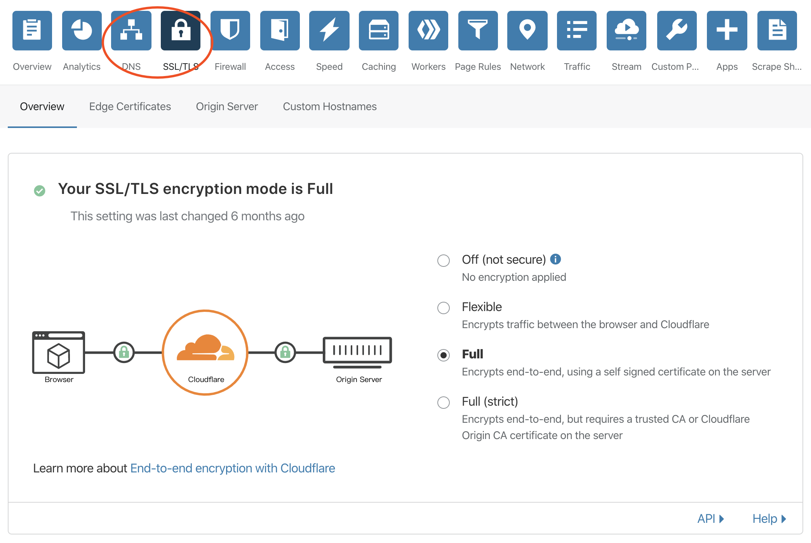

## 关键字

### SSL
Secure Socket Layer  
安全套接字层

位于可靠的面向连接的网络层协议和应用层协议之间的一种协议层。SSL通过互相认证、使用数字签名确保完整性、使用加密确保私密性，以实现客户端和服务器之间的安全通讯。该协议由两层组成：SSL记录协议和SSL握手协议。

### TLS
Transport Layer Security  
传输层安全协议

用于两个应用程序之间提供保密性和数据完整性。该协议由两层组成：TLS记录协议和TLS握手协议。


众所周知，网景公司 20 世纪 90 年代在和微软的竞争中最终败下阵来，之后网景公司将 SSL 协议的管理权转交给 IETF（Internet Engineering Task Force, www.ietf.org）。  
于是 IETF 将 SSL 作了标准化，重新命名为 TLS（Transport Layer Security）。在 1999 年，TLS 1.0 诞生了（其实也就是 SSL 3.1）  
HTTPS（HyperText Transfer Protocol Secure）是建立在 SSL/TLS 协议之上，信息通信通过 SSL/TLS 进行加密，最后一个 S 就是 Secure 的缩写，代表安全的意思，HTTPS = HTTP+SSL/TLS。

### ACME
[Automatic Certificate Management Environment](https://tools.ietf.org/html/rfc8555)

ACME 协议最初由 Let's Encrypt 团队开发并被认为是其提供的 CA 服务的核心。ACMEv1 协议旨在确保验证、发布和管理方法是完全自动化、一致、符合合规性和安全的。

ACME成为标准对证书颁发和管理的重要性体现在两个方面。第一是提高了软件生态系统的质量。因为标准确定后，开发者可以专注于针对单个协议开发优秀的软件，而不是为定制的 API 提供许多维护不良的软件。第二，标准化协议大大降低了技术依赖性锁定所带来的影响，使得可从一个 CA 更容易地切换到另一个 CA —— 给予了使用者更自由和便利的选择。

## 申请证书

### 云产商
如阿里云等各大云产商都集成了国内外各种高大上的 CA 机构证书，可以直接购买使用。

### 免费证书

#### 云服务
`cloudflare` `netlify` 等过个国外的 CND PAAS服务商都有提供免费的HTTPS服务，将域名DNS解析指向他们即可。


#### 开源力量

* https://github.com/letsencrypt/letsencrypt
* https://github.com/certbot/certbot

  ```bash
  $ ./letsencrypt-auto --help

  run：获取并安装证书到当前的Web服务器
  certonly：获取或续期证书，但是不安装
  renew：在证书快过期时，续期之前获取的所有证书
  -d DOMAINS：一个证书支持多个域名，用逗号分隔
  --apache：使用 Apache 插件来认证和安装证书
  --standalone：运行独立的 web server 来验证
  --nginx：使用 Nginx 插件来认证和安装证书
  --webroot：如果目标服务器已经有 web server 运行且不能关闭，可以通过往服务器的网站根目录放置文件的方式来验证
  --manual：通过交互式方式，或 Shell

  $ ./letsencrypt-auto run -d ifuture.pro -d www.ifuture.pro --nginx

  ```

  https://certbot.eff.org/lets-encrypt/ubuntubionic-nginx


* https://github.com/acmesh-official/acme.sh

  [使用教程](https://github.com/acmesh-official/acme.sh/wiki/%E8%AF%B4%E6%98%8E)

## 配置证书
[SSL Configuration Generator](https://ssl-config.mozilla.org/#server=nginx)

## 证书格式
* PEM
> 适用于Apache、Nginx、Candy Server等Web服务器  
常见的文件后缀为.pem、.crt、.cer、.key  
可以存放证书或私钥，或者两者都包含  
.key后缀一般只用于证书私钥文件  

* PFX
> 适用于IIS等Web服务器  
常见的文件后缀为.pfx、.p12  
同时包含证书和私钥，且一般有密码保护  

* JKS
> 适用于Tomcat、Weblogic、JBoss、Jetty等Web服务器  
常见的文件后缀为.jks

> Let's Encrypt颁发的HTTPS证书一般包括以下几个文件：  
cert.key（PEM格式）：私钥文件  
cert.cer（PEM格式）：证书文件  
fullchain.cer（PEM格式）：包含证书和中间证书  

**PEM ===> PFX**  
` openssl pkcs12 -export -out cert.pfx -inkey cert.key -in fullchain.cer`

**PFX ===> JKS**  
`  keytool -importkeystore -srckeystore cert.pfx -destkeystore cert.jks -srcstoretype PKCS12 -deststoretype JKS
`

**PEM ===> JKS**  
先将PEM文件转换为PFX文件，然后再将PFX文件转换为JKS文件

**PFX ===> PEM**  
1. 使用cert.pfx文件生成临时文件temp.cer，temp.cer中包含了证书和私钥  
`openssl pkcs12 -in cert.pfx -nodes -out temp.cer`  
1. 使用临时文件temp.cer文件生成私钥文件cert.key
  `openssl rsa -in temp.cer -out cert.key`
1. 使用临时文件temp.cer文件生成证书文件cert.cer
  `openssl x509 -in temp.cer -out cert.cer`
1. 使用cert.pfx生成中间证书文件chain.cer，合并cert.cer、空白行、chain.cer即可得到fullchain.cer
```shell
openssl pkcs12 -in cert.pfx -cacerts -nokeys -chain | sed -ne '/-BEGIN CERTIFICATE-/,/-END CERTIFICATE-/p' > chain.cer
echo '\n' > emptyline.cer
cat cert.cer emptyline.cer chain.cer> fullchain.cer
```

**JKS ===> PFX**  
`  keytool -importkeystore -srckeystore cert.jks -destkeystore cert.pfx -srcstoretype JKS -deststoretype PKCS12
`

## DNS 服务器
BIND （Berkeley Internet Name Domain）

`yum -y install bind bind-chroot bind-utils`
