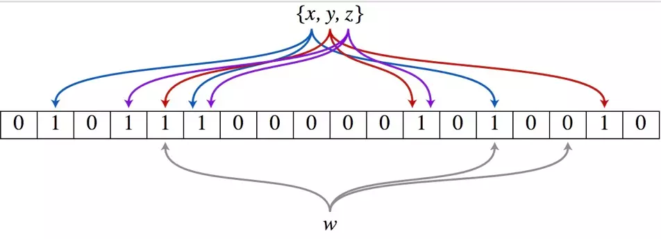

布隆过滤器 Bloom Filter
------
## 应用场景
在大量是数据池中找出某元素是否存在。
* 字处理软件中，需要检查一个英语单词是否拼写正确
* 在 FBI，一个嫌疑人的名字是否已经在嫌疑名单上
* 在网络爬虫里，一个网址是否被访问过
* yahoo, gmail等邮箱垃圾邮件过滤功能

联想到的解决方案
* 数组
* 链表
* 树、平衡二叉树、Trie
* Map (红黑树)
* 哈希表

对于这些方案 BloomFilter 具有时间和空间上的优势


## 原理

布隆过滤器（Bloom Filter）的核心实现是一个超大的位数组和几个哈希函数。假设位数组的长度为m，哈希函数的个数为k



假设集合里面有3个元素{x, y, z}，哈希函数的个数为3。首先将位数组进行初始化，将里面每个位都设置位0。对于集合里面的每一个元素，将元素依次通过3个哈希函数进行映射，每次映射都会产生一个哈希值，这个值对应位数组上面的一个点，然后将位数组对应的位置标记为1。查询W元素是否存在集合中的时候，同样的方法将W通过哈希映射到位数组上的3个点。如果3个点的其中有一个点不为1，则可以判断该元素一定不存在集合中。反之，如果3个点都为1，则该元素可能存在集合中。注意：此处不能判断该元素是否一定存在集合中，可能存在一定的误判率。可以从图中可以看到：假设某个元素通过映射对应下标为4，5，6这3个点。虽然这3个点都为1，但是很明显这3个点是不同元素经过哈希得到的位置，因此这种情况说明元素虽然不在集合中，也可能对应的都是1，这是误判率存在的原因。

## 实现

### 基础实现
对于程序员来说概念不好理解，代码更好理解。下面就是基础的实现方式，目的就是更好的理解实现原理。

```java
import java.util.BitSet;

public class SimpleBloomFilter {

    private static final int DEFAULT_SIZE = 2 << 24;
    private static final int[] seeds = new int[] {7, 11, 13, 31, 37, 61,};

    private BitSet bits = new BitSet(DEFAULT_SIZE);
    private SimpleHash[] func = new SimpleHash[seeds.length];

    public static void main(String[] args) {
        String value = "Hello World";
        SimpleBloomFilter filter = new SimpleBloomFilter();
        System.out.println(filter.contains(value));
        filter.add(value);
        System.out.println(filter.contains(value));
    }

    public SimpleBloomFilter() {
        for (int i = 0; i < seeds.length; i++) {
            func[i] = new SimpleHash(DEFAULT_SIZE, seeds[i]);
        }
    }

    public void add(String value) {
        for (SimpleHash f : func) {
            bits.set(f.hash(value), true);
        }
    }

    public boolean contains(String value) {
        if (value == null) {
            return false;
        }
        boolean ret = true;
        for (SimpleHash f : func) {
            ret = ret && bits.get(f.hash(value));
        }
        return ret;
    }

    public static class SimpleHash {

        private int cap;
        private int seed;

        public SimpleHash(int cap, int seed) {
            this.cap = cap;
            this.seed = seed;
        }

        public int hash(String value) {
            int result = 0;
            int len = value.length();
            for (int i = 0; i < len; i++) {
                result = seed * result + value.charAt(i);
            }
            return (cap - 1) & result;
        }

    }
}
```

### 生产实现
* [Guava](https://mvnrepository.com/artifact/com.google.guava/guava) com.google.common.hash.BloomFilter
* [BloomFilter.java](../assets/code/BloomFilter.java)  [usedby](https://github.com/MagnusS/Java-BloomFilter/blob/master/src/com/skjegstad/utils/BloomFilter.java)
