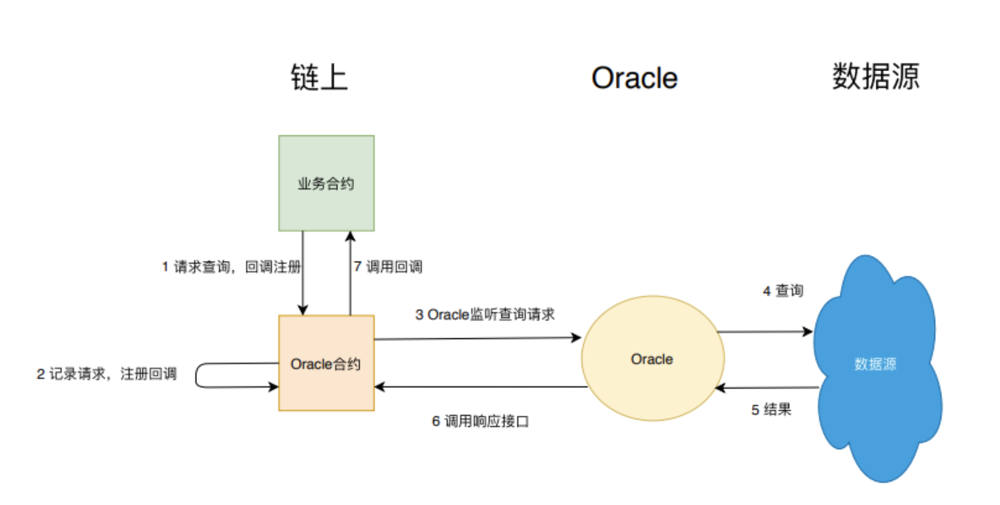

## 设计模式
《Design Patterns For Smart Contracts In the Ethereum Ecosystem》
### 安全 Security
* Checks-Effects-Interaction 保证状态完整，再做外部调用

  Checks：参数验证，Effects：修改合约状态，Interaction：外部交互
  这个模式要求合约按照Checks-Effects-Interaction的顺序来组织代码。它的好处在于进行外部调用之前，Checks-Effects已完成合约自身状态所有相关工作，使得状态完整、逻辑自洽，这样外部调用就无法利用不完整的状态进行攻击

* Mutex - 禁止递归

  使用修饰符防止函数被递归调用。防止重放攻击
  ```javascript
  contract Mutex {
    bool locked;
    modifier noReentrancy() {
        //防止递归
        require(!locked, "Reentrancy detected");
        locked = true;
        _;
        locked = false;
    }

    //调用该函数将会抛出Reentrancy detected错误
    function some() public noReentrancy{
        some();
    }
}
  ```

### 可维护性 Maintaince

高度模块化、高内聚低耦合

* Data segregation - 数据与逻辑相分离
```javascript
contract DataRepository{

    uint private _data;

    function setData(uint data) public {
        _data = data;
    }

    function getData() public view returns(uint){
        return _data;
    }
}
contract Computer{
    DataRepository private _dataRepository;
    constructor(address addr){
        _dataRepository = DataRepository(addr);
    }

    //业务代码
    function compute() public view returns(uint){
        return _dataRepository.getData() * 10;
    }    
}
```

* Satellite - 分解合约功能
```javascript
contract Base {
    uint public _variable;

    function setVariable(uint data) public {
        _variable = _satellite.compute(data);
    }

     Satellite _satellite;
    //更新子合约（卫星合约）
    function updateSatellite(address addr) public {
        _satellite = Satellite(addr);
    }
}
contract Satellite {
    function compute(uint a) public returns(uint){
        return a * 10;        
    }
}
```

* Contract Registry - 跟踪最新合约
```javascript
contract Registry{

    address _current;
    address[] _previous;

    //子合约升级了，就通过update函数更新地址
    function update(address newAddress) public{
        if(newAddress != _current){
            _previous.push(_current);
            _current = newAddress;
        }
    }

    function getCurrent() public view returns(address){
        return _current;
    }
}
contract Base {
    uint public _variable;

    function setVariable(uint data) public {
        Satellite satellite = Satellite(_registry.getCurrent());
        _variable = satellite.compute(data);
    }

    Registry private _registry = //...;
}
```

* Contract Relay - 代理调用最新合约
```javascript
contract Base {
    uint public _variable;

    function setVariable(uint data) public {
        _variable = _proxy.compute(data);
    }
    SatelliteProxy private _proxy = //...;
}
contract SatelliteProxy{
    address _current;
    function compute(uint a) public returns(uint){
        Satellite satellite = Satellite(_current);   
        return satellite.compute(a);
    }

    //子合约升级了，就通过update函数更新地址
    function update(address newAddress) public{
        if(newAddress != _current){
            _current = newAddress;
        }
    }   
}
contract Satellite {
    function compute(uint a) public returns(uint){
        return a * 10;        
    }
}
```

### 生命周期 Lifecycle
* Mortal - 允许合约自毁
```javascript
contract Mortal{
    //自毁
    function destroy() public{
        //selfdestruct指令，用于销毁合约
        selfdestruct(msg.sender);
    }
}
```

* Automatic Deprecation - 允许合约自动停止服务

  当用户调用service，notExpired修饰符会先进行日期检测，这样，一旦过了特定时间，调用就会因过期而被拦截在notExpired层。
```javascript
contract AutoDeprecated{

    uint private _deadline;

    function setDeadline(uint time) public {
        _deadline = time;
    }

    modifier notExpired(){
        require(now <= _deadline);
        _;
    }

    function service() public notExpired{
        //some code    
    }
}
```

### 权限 Authorization

* Ownership
```javascript
contract Ownable {
    address public owner;

    event OwnershipRenounced(address indexed previousOwner);
    event OwnershipTransferred(
        address indexed previousOwner,
        address indexed newOwner
    );

    constructor() public {
        owner = msg.sender;
    }

    modifier onlyOwner() {
        require(msg.sender == owner);
        _;
    }

    function transferOwnership(address newOwner) public onlyOwner {
        require(newOwner != address(0));
        emit OwnershipTransferred(owner, newOwner);
        owner = newOwner;
    }

    function renounceOwnership() public onlyOwner {
        emit OwnershipRenounced(owner);
        owner = address(0);
    }
}
//继承并添加修饰器
contract Biz is Owned{
    function manage() public onlyOwner{
    }
}
```

### 行为控制 Action And Control

* Commit - Reveal - 延迟秘密泄露
Commit And Reveal模式允许用户将要保护的数据转换为不可识别数据，比如一串哈希值，直到某个时刻再揭示哈希值的含义，展露真正的原值。  
以投票场景举例，假设需要在所有参与者都完成投票后再揭示投票内容，以防这期间参与者受票数影响
```javascript
contract CommitReveal {
    struct Commit {
        string choice;
        string secret;
        uint status;
    }
    mapping(address => mapping(bytes32 => Commit)) public userCommits;
    event LogCommit(bytes32, address);
    event LogReveal(bytes32, address, string, string);

    function commit(bytes32 commit) public {
        Commit storage userCommit = userCommits[msg.sender][commit];
        require(userCommit.status == 0);
        userCommit.status = 1; // comitted
        emit LogCommit(commit, msg.sender);
    }

    function reveal(string choice, string secret, bytes32 commit) public {
        Commit storage userCommit = userCommits[msg.sender][commit];
        require(userCommit.status == 1);
        require(commit == keccak256(choice, secret));
        userCommit.choice = choice;
        userCommit.secret = secret;
        userCommit.status = 2;
        emit LogReveal(commit, msg.sender, choice, secret);
    }
}
```

* Oracle - 读取链外数据
  获取外部数据会通过名为Oracle的链外数据层来执行。当业务方的合约尝试获取外部数据时，会先将查询请求存入到某个Oracle专用合约内；Oracle会监听该合约，读取到这个查询请求后，执行查询，并调用业务合约响应接口使合约获取结果。

```javascript
contract Oracle {
    address oracleSource = 0x123; // known source

    struct Request {
        bytes data;
        function(bytes memory) external callback;
    }

    Request[] requests;
    event NewRequest(uint);
    modifier onlyByOracle() {
        require(msg.sender == oracleSource); _;
    }

    function query(bytes data, function(bytes memory) external callback) public {
        requests.push(Request(data, callback));
        emit NewRequest(requests.length - 1);
    }

    //回调函数，由Oracle调用
    function reply(uint requestID, bytes response) public onlyByOracle() {
        requests[requestID].callback(response);
    }
}
contract BizContract {
    Oracle _oracle;

    constructor(address oracle){
        _oracle = Oracle(oracle);
    }

    modifier onlyByOracle() {
        require(msg.sender == address(_oracle));
        _;
    }

    function updateExchangeRate() {
        _oracle.query("USD", this.oracleResponse);
    }

    //回调函数，用于读取响应
    function oracleResponse(bytes response) onlyByOracle {
    // use the data
    }
}
```
