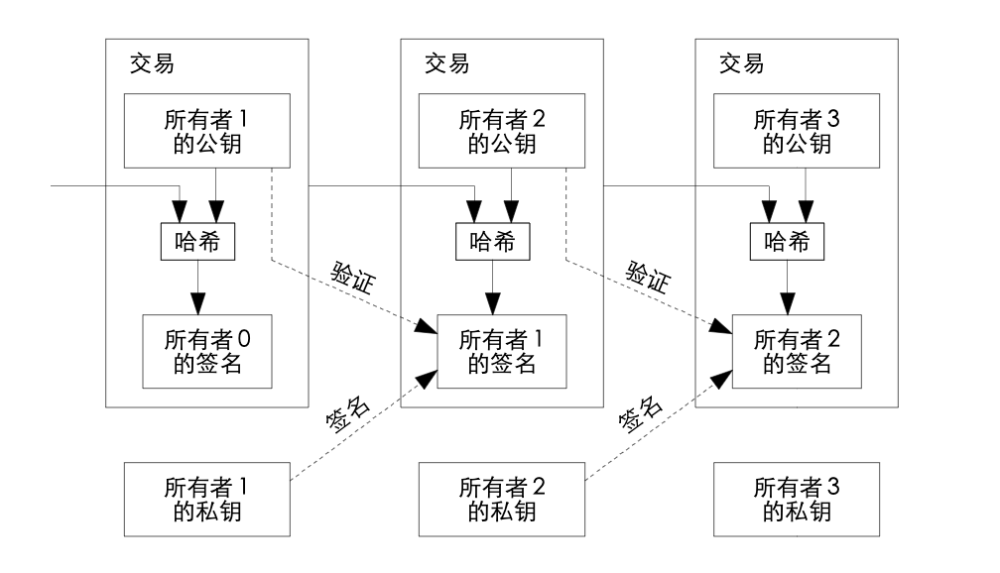
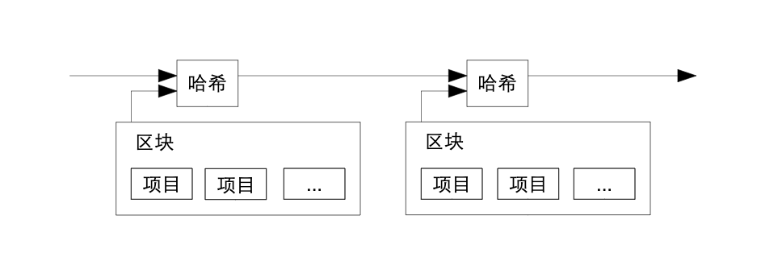
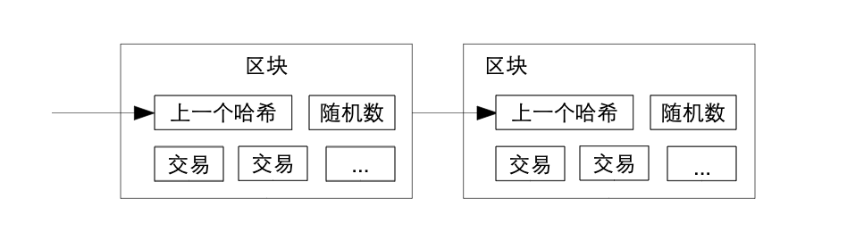
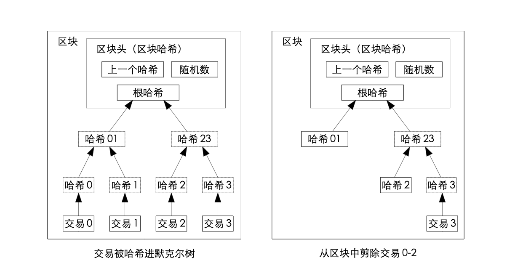
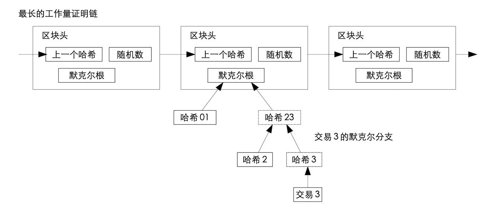
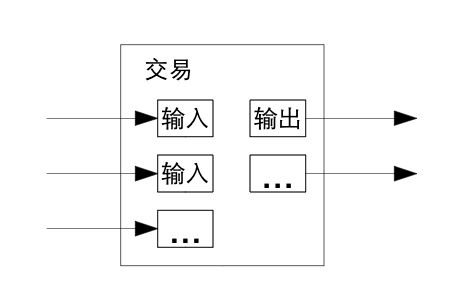
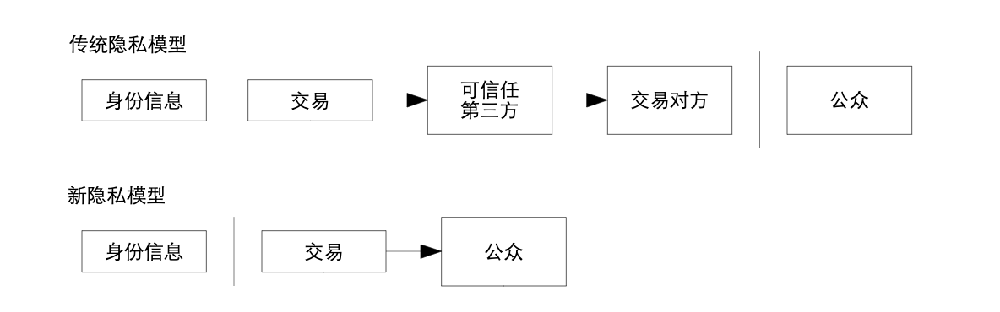

> 比特币 white paper中英文对照版本，保持英文原版只字不差，排版尽量模拟原版

Bitcoin: A Peer-to-Peer Electronic Cash System
-------
比特币：一种点对点电子货币系统
-------
 Satoshi Nakamoto  
 satoshin@gmx.com  
 www.bitcoin.org  

> **Abstract.**   A  purely   peer-to-peer   version   of   electronic   cash   would   allow   onlinepayments   to   be   sent   directly   from   one   party   to   another   without   going   through   afinancial institution.   Digital signatures provide part of the solution, but the mainbenefits are lost if a trusted third party is still required to prevent double-spending.We propose a solution to the double-spending problem using a peer-to-peer network.The   network   timestamps   transactions   by   hashing   them   into   an   ongoing   chain   ofhash-based proof-of-work, forming a record that cannot be changed without redoingthe proof-of-work.   The longest chain not only serves as proof of the sequence ofevents witnessed, but proof that it came from the largest pool of CPU power.   Aslong as a majority of CPU power is controlled by nodes that are not cooperating toattack the network,  they'll  generate the  longest  chain  and  outpace attackers.   Thenetwork itself requires minimal structure.   Messages are broadcast on a best effortbasis,   and   nodes   can   leave   and   rejoin   the   network   at   will,   accepting   the   longestproof-of-work chain as proof of what happened while they were gone.

> **摘要。** 一种完全的点对点电子现金应当允许在线支付从一方直接发送到另一方而不需要通过一个金融机构。数字签名提供了部分解决方案，但如果仍需一个可信任第三方来防止双重支付，那就失去了电子货币的主要优点。我们提出一种使用点对点网络解决双重支付问题的方案。该网络通过将交易哈希进一条持续增长的基于哈希的工作量证明链来给交易打上时间戳，形成一条除非重做工作量证明否则不能更改的记录。最长的链不仅是被见证事件序列的证据，而且也是它本身是由最大 CPU 算力池产生的证据。只要多数的 CPU 算力被不打算联合攻击网络的节点控制，这些节点就将生成最长的链而超过攻击者。这种网络本身只需极简的架构。信息将被尽力广播，节点可以随时离开和重新加入网络，只需接受最长的工作量证明链作为它们离开时发生事件的证据。

## 1. Introduction
Commerce on the Internet has come to rely almost exclusively on financial institutions serving astrusted third  parties  to process electronic payments.   While the  system works  well enough formost   transactions,   it   still   suffers   from   the   inherent   weaknesses   of   the   trust   based   model.Completely non-reversible transactions are not really possible, since financial institutions cannotavoid   mediating   disputes.     The   cost   of   mediation   increases   transaction   costs,   limiting   theminimum practical transaction size and cutting off the possibility for small casual transactions,and   there   is   a   broader   cost   in   the   loss   of   ability   to   make   non-reversible   payments   for   non-reversible services.  With the possibility of reversal, the need for trust spreads.  Merchants mustbe wary of their customers, hassling them for more information than they would otherwise need.A certain percentage of fraud is accepted as unavoidable.  These costs and payment uncertaintiescan be avoided in person by using physical currency, but no mechanism exists to make paymentsover a communications channel without a trusted party.What is needed is an electronic payment system based on cryptographic proof instead of trust,allowing any two willing parties to transact directly with each other without the need for a trustedthird  party.     
Transactions  that  are  computationally  impractical  to   reverse   would  protect  sellersfrom fraud, and routine escrow mechanisms could easily be implemented to protect buyers.   Inthis paper, we propose a solution to the double-spending problem using a peer-to-peer distributedtimestamp server to generate computational proof of the chronological order of transactions.  Thesystem   is   secure   as   long   as   honest   nodes   collectively   control   more   CPU   power   than   anycooperating group of attacker nodes.


## 1、简介
互联网贸易已经变得几乎完全依赖金融机构作为可信任第三方来处理电子支付。尽管对于大部分交易这种系统运行得足够好，但仍需忍受基于信任模型这个固有缺点。由于金融机构不可避免的需要仲裁纠纷，完全的不可撤销交易实际是做不到的。仲裁成本增加了交易成本，限制了最小实际交易额度从而杜绝了日常小额交易的可能性，而且由于不支持不可撤销支付，对不可撤销服务进行支付将需要更大的成本。由于存在交易被撤销的可能性，对于信任的需求将更广泛。商家必须警惕他们的客户，麻烦他们提供更多他本不必要的信息。一定比例的欺诈被认为是不可避免的。虽可通过当面使用实物货币来避免这些成本及支付的不确定性，但不存在不引入一个可信任方而能在通信通道上进行支付的机制。   
我们需要的是一个基于密码学原理而不是信任的电子支付系统，该系统允许任何有交易意愿的双方能直接交易而不需要一个可信任第三方。交易在计算上的不可撤销将保护卖家不被欺诈，用来保护买家的程序化合约机制也应该较容易实现。在这篇论文中，我们提出一种使用点对点分布式时间戳服务器为基于时间的交易序列生成计算上的证据来解决双重支付问题的方案。只要诚实节点集体控制的CPU算力大于每一个合作攻击节点群的CPU算力，这个系统就是安全的。

## 2. Transactions
We define an electronic coin as a chain of digital signatures.  Each owner transfers the coin to thenext by digitally signing a hash of the previous transaction and the public key of the next ownerand adding these to the end of the coin.  A payee can verify the signatures to verify the chain of ownership.  
## 2、交易  
我们定义一枚电子货币就是一条数字签名链。每个拥有者都通过将上一次交易和下一个拥有者的公钥的哈希值的数字签名添加到此货币末尾的方式将这枚货币转移给下一个拥有者。收款人可以通过验证数字签名来证实其为该链的所有者。

The problem of course is the payee can't verify that one of the owners did not double-spendthe coin.  A common solution is to introduce a trusted central authority, or mint, that checks everytransaction for double spending.  After each transaction, the coin must be returned to the mint toissue a new coin, and only coins issued directly from the mint are trusted not to be double-spent.The   problem   with   this   solution   is   that   the   fate   of   the   entire   money   system   depends   on   thecompany running the mint, with every transaction having to go through them, just like a bank.  
We   need   a   way   for   the   payee   to   know   that   the   previous   owners   did   not   sign   any   earliertransactions.   For our purposes, the earliest transaction is the one that counts, so we don't careabout later attempts to double-spend.  The only way to confirm the absence of a transaction is tobe aware of all transactions.  In the mint based model, the mint was aware of all transactions anddecided   which   arrived   first.    To  accomplish   this   without   a   trusted   party,   transactions   must   bepublicly announced [1], and we need a system for participants to agree on a single history of theorder in which they were received.  The payee needs proof that at the time of each transaction, themajority of nodes agreed it was the first received.  
这里的问题是收款人不能证实拥有者之一没有对此货币进行双重支付。通常的做法是引入一个可信任的中央机构或铸币厂来检查每笔交易是否存在双重支付。每笔交易之后，都需要将这枚货币退回铸币厂以换取发行一枚新的货币，只有由铸币厂直接发行的货币才能被确认没有被双重支付。这个方案的问题在于整个货币系统的命运都依赖于运营铸币厂的公司，每笔交易都需要经过它们，就像银行一样。  
我们需要一种能让收款人知道上一个货币拥有者 没有对任何更早的交易签名的方法。对我们来说，最早的那次交易是唯一有效的，所以我们不需要关心本次交易后面的双重支付尝试 。唯一能确保一笔交易不存在的方法是知晓所有之前的交易。在铸币厂模型中，铸币厂知晓所有交易并能确定哪笔交易最先到达。在不引入一个可信任方的前提下要达到这个目的， 所有交易就必须公开发布[1]，而且需要一个能让所有参与者对交易收到顺序的单一历史达成共识的系统。收款人在每笔交易时，都需要多数节点认同此交易是最先收到的证据。

## 3. Timestamp Server
The solution we propose begins with a timestamp server.  A timestamp server works by taking ahash   of   a   block   of   items   to   be   timestamped   and   widely   publishing   the   hash,   such   as   in   anewspaper or Usenet post [2-5].   The timestamp proves that the data must have existed at thetime, obviously, in order to get into the hash.  Each timestamp includes the previous timestamp inits hash, forming a chain, with each additional timestamp reinforcing the ones before it.

## 3、时间戳服务器
我们提出的方案从时间戳服务器开始。时间戳服务器计算包含 多个需要被打时间戳的数据项的区块 的哈希  值并 广泛 地发布这个哈希值，就 像在报纸或  新闻组帖  子里[2-5]。时间戳能证明要得到这个哈希值，显然这些数据当时一定是存在的。每个时间戳的哈希值都纳 入了上一个时间戳，形成一条链，后面的时间戳进一步增强前一个时间戳。



## 4. Proof-of-Work
To implement a distributed timestamp server on a peer-to-peer basis, we will need to use a proof-of-work system  similar to Adam  Back's  Hashcash  [6],  rather than  newspaper  or  Usenet  posts.The proof-of-work involves scanning for a value that when hashed, such as with SHA-256, thehash begins with a number of zero bits.  The average work required is exponential in the numberof zero bits required and can be verified by executing a single hash.  
For our timestamp network, we implement the proof-of-work by incrementing a nonce in theblock until a value is found that gives the block's hash the required zero bits.   Once the CPUeffort   has   been   expended   to   make   it   satisfy   the   proof-of-work,   the   block   cannot   be   changedwithout  redoing  the   work.    As   later   blocks   are  chained   after  it,   the  work  to  change  the  blockwould include redoing all the blocks after it.

## 4、工作量证明
为了实现一个基于点对点的时间戳服务器，我们需要使用一个类似Adam Back 提出的哈希货币[6] 的工作量证明系统，而不是报纸或新闻组帖子那样。工作量证明采取搜索一个数，使得被哈希时，如使用SHA-256，得到的哈希值以数个0比特开始。平均所需工作量将随所需 0比特呈指数级增长而验证却只需执行一次哈希。  
对于我们的时间戳网络。我们通过在区块中加入一个随机数，直到使得区块的哈希值满足所需0比特的数被找到的方式实现工作量证明。一旦消耗了CPU算力使区块满足了工作量证明，那么除非重做这个工作否则就无法更改 区块 。由于后面的区块是链接在这个区块后面的，改变这个区块将需要重做所有后面的区块。

The proof-of-work also solves the problem of determining representation in majority decisionmaking.  If the majority were based on one-IP-address-one-vote, it could be subverted by anyoneable   to   allocate   many   IPs.     Proof-of-work   is   essentially   one-CPU-one-vote.     The   majoritydecision is represented by the longest chain, which has the greatest proof-of-work effort investedin it.  If a majority of CPU power is controlled by honest nodes, the honest chain will grow thefastest and outpace any competing chains.   To modify a past block, an attacker would have toredo the proof-of-work of the block and all blocks after it and then catch up with and surpass thework of the honest nodes.  We will show later that the probability of a slower attacker catching updiminishes exponentially as subsequent blocks are added.  
To compensate for increasing hardware speed and varying interest in running nodes over time,the proof-of-work difficulty is determined by a moving average targeting an average number ofblocks per hour.  If they're generated too fast, the difficulty increases.  
工作量证明同时解决了在多数决定中确定投票方式的问题。如果多数是按IP地址投票来决定，那么它将可能被能分配大量IP 地址的人破坏 。工作量证明本质上是 按CPU 投票。最长的链代表了多数决定，因为有最大的计算工作量证明的精力投入到这条链上。如果多数的CPU算力被诚实节点控制，诚实的链就会增长得最快并超过其他的竞争链。要修改过去的某区块，攻击者必须重做这个区块以及其后的所有区块的工作量证明从而赶上并超过诚实节点的工作。我们后面会证明随着后续的区块被添加一个更慢的攻击者赶上诚实节点的概率将呈指数级递减。  
为了抵消硬件运算速度的增加及平衡不同时期运行节点的利益，工作量证明的难度将由移动平均数法来确定每小时生成区块的平均数。如果区块生成得过快，那么生成的难度就会增加。

## 5. Network
The steps to run the network are as follows:

1) New transactions are broadcast to all nodes.  
2) Each node collects new transactions into a block.    
3) Each node works on finding a difficult proof-of-work for its block.  
4) When a node finds a proof-of-work, it broadcasts the block to all nodes.  
5) Nodes accept the block only if all transactions in it are valid and not already spent.  
6) Nodes express their acceptance of the block by working on creating the next block in thechain, using the hash of the accepted block as the previous hash.

Nodes   always   consider   the   longest   chain   to   be   the   correct   one   and   will   keep   working   onextending it.   If two nodes broadcast different versions of the next block simultaneously, somenodes may receive one or the other first.  In that case, they work on the first one they received,but save the other branch in case it becomes longer.  The tie will be broken when the next proof-of-work   is   found   and   one   branch   becomes   longer;   the   nodes   that   were   working   on   the   otherbranch will then switch to the longer one.  
New transaction broadcasts do not necessarily need to reach all nodes.  As long as they reachmany nodes, they will get into a block before long.  Block broadcasts are also tolerant of droppedmessages.  If a node does not receive a block, it will request it when it receives the next block andrealizes it missed one.

## 5、网络
运行网络的步骤如下：

1) 新交易向所有节点广播。  
2) 每个节点将新交易收集到一个区块。  
3) 每个节点为它的区块寻找工作量证明。  
4) 当一个节点找到了工作量证明，就向所有节点广播这个区块。  
5) 节点只有在区块内所有交易都是有效的且之前没有被支付的情况下接收这个区块。  
6) 节点通过使用这个区块的哈希值作为上一个哈希值在链中创建下一个区块的方式表示对这个区块的接受。

节点总是认为最长的链为正确的并持续致力于延长它。如果两个节点同时广播了不同的下一个区块，有些节点可能先收到其中一个而其他节点先收到另一个。这种情况，节点基于他们收到的第一个区块工作，但是也保存另一个分支以防它变为更长的链。当下一个工作量证明被找到后，僵局就会被打破从而其中一个分支变得更长；在另一个分支上工作的节点将切换到更长的链上来。新交易的广播不必到达所有的节点。只要到达一些节点，不久就会进入到一个区块 。区块广播也是能容忍消息丢失的。如果一个节点没有收到某个区块 ，它将在收到下一个区块时发现它丢失了一个区块然后去请求这个区块。

## 6. Incentive
By convention, the first transaction in a block is a special transaction that starts a new coin ownedby the creator of the block.  This adds an incentive for nodes to support the network, and providesa way to initially distribute coins into circulation, since there is no central authority to issue them.The steady addition of a constant of amount of new coins is analogous to gold miners expendingresources to add gold to circulation.  In our case, it is CPU time and electricity that is expended.  
The incentive can also be funded with transaction fees.  If the output value of a transaction isless than its input value, the difference is a transaction fee that is added to the incentive value ofthe   block   containing   the   transaction.     Once   a   predetermined   number   of   coins   have   enteredcirculation, the incentive can transition entirely to transaction fees and be completely inflationfree.  
The   incentive   may   help   encourage   nodes   to   stay   honest.     If   a   greedy   attacker   is   able   toassemble more CPU power than all the honest nodes, he would have to choose between using itto defraud people by stealing back his payments, or using it to generate new coins.  He ought tofind it more profitable to play by the rules, such rules that favour him with more new coins thaneveryone else combined, than to undermine the system and the validity of his own wealth.

## 6、激励
我们约定，区块中的第一笔交易是区块创建者开启一枚属于他的新货币的特殊的交易。这就增加了对支持网络的节点的激励 ，并提供了一种分发货币到流通领域的方法，因为这里没有中央机构来发行货币。新货币按固定量  稳定地增加就像金矿矿工消耗资源并增加黄金到流通领域一样。对我们而言，消耗的是 CPU 时间和电力。  
激励也可以由交易费充当。如果交易的输出值小于其输入值，差价就作为交易费被加到包含此交易的区块的激励中  。一旦预定量的货币进入了流通领域，激励将变为只含有交易费，这样可以完全避免通货膨胀。  
激励会有助于鼓励节点保持诚实。如果一个贪心的攻击者有能力聚集比所有诚实节点更多的CPU算力，他将面临是以骗回已付款的方式欺诈别人还是使用这些算力生成新货币的抉择。他将发现遵守规则比破坏系统和他自己财产的有效性更有利，因为这些规则准许他获得比所有其他人都多的新货币。

## 7. Reclaiming Disk Space
Once the latest transaction in a coin is buried under enough blocks, the spent transactions beforeit   can   be   discarded   to   save   disk   space.     To   facilitate   this   without   breaking   the   block's   hash,transactions are hashed in a Merkle Tree [7][2][5], with only the root included in the block's hash.Old blocks can then be compacted by stubbing off branches of the tree.   The interior hashes donot need to be stored.

## 7、回收磁盘空间
一旦某个货币的最新交易已经被足够多的区块覆盖，这之前的支付交易就可以被丢弃 以节省磁盘空间。为便于此而又不破坏区块的哈希值，交易将被哈希进默克尔树[7][2][5]，只有根节点被纳入到区块的哈希值。老的区块可通过剪除树枝的方式被压缩。树枝内部的哈希不需要被保存。



A  block   header   with   no   transactions   would   be   about   80   bytes.     If   we   suppose   blocks   aregenerated every 10 minutes, 80 bytes * 6 * 24 * 365 = 4.2MB per year.  With computer systemstypically selling with 2GB of RAM as of 2008, and Moore's Law predicting current growth of1.2GB   per   year,   storage   should   not   be   a   problem   even   if   the   block   headers   must   be   kept   inmemory.

每个不包含交易的区块头大约是 80 bytes。如果每10分钟生成一个区块 ，每年生成 80bytes * 6 * 24 * 365 = 4.2MB，2008年在售的典型计算机有2GB内存， 并且摩尔定律预测目前每年内存增加 1.2GB，所以就算区块头一定要存在内存里，存储也不是问题。

## 8. Simplified Payment Verification
It is possible to verify payments without running a full network node.  A user only needs to keepa copy of the block headers of the longest proof-of-work chain, which he can get by queryingnetwork   nodes   until   he's   convinced   he   has   the   longest   chain,   and   obtain   the   Merkle   branchlinking   the   transaction   to   the   block   it's   timestamped   in.     He   can't   check   the   transaction   forhimself, but by linking it to a place in the chain, he can see that a network node has accepted it,and blocks added after it further confirm the network has accepted it.
## 8、 简化的支付验证
不运行一个完整的网络节点也是可以进行支付验证的。用户只需拥有一个最长工作量证明链的区块头副本，他可以通过向其他网络节点查询以确认他拥有了最长的链，并获取链接交易到给交易打时间戳区块的默克尔分支。虽然他自己不能核实这个交易，但如果交易已经链接到到链中的某个位置，就说明一个网络节点已经接受了此交易，而其后追加的区块进一步确认网络已经接受了它。



As such, the verification is reliable as long as honest nodes control the network, but is morevulnerable   if   the   network   is   overpowered   by   an   attacker.     While   network   nodes   can   verifytransactions   for   themselves,   the   simplified   method   can   be   fooled   by   an   attacker's   fabricatedtransactions for as long as the attacker can continue to overpower the network.   One strategy toprotect against this would be to accept alerts from network nodes when they detect an invalidblock,   prompting   the   user's   software   to   download   the   full   block   and   alerted   transactions   toconfirm the inconsistency.  Businesses that receive frequent payments will probably still want torun their own nodes for more independent security and quicker verification.  
同样地，只要诚实节点控制着网络这种简化验证就是可靠的，如果网络被攻击者控制简化验证会变得比较脆弱 。虽然网络节点可以验证他们自己的交易，但只要攻击者持续控制网络那么这种简化的方法就可能被攻击者的伪造交易欺骗。一种对策是接受其他网络节点发现一个无效区块时发出的警告，提醒用户软件下载整个区块和被警告的交易来检查一致性。为了更加独立的安全性以及更快的支付确认，收款频繁的公司可能仍需运行他们自己的节点。

## 9. Combining and Splitting Value
Although   it   would   be   possible   to   handle   coins   individually,   it   would   be   unwieldy   to   make   aseparate   transaction   for   every   cent   in   a   transfer.     To   allow   value   to   be   split   and   combined,transactions  contain  multiple  inputs  and  outputs.    Normally  there will  be either  a  single  inputfrom a larger previous transaction or multiple inputs combining smaller amounts, and at most twooutputs: one for the payment, and one returning the change, if any, back to the sender.   
## 9、合并和分割交易额
尽管单独处理每个货币是可行的，但将一次转账按每一分拆成多次交易是笨拙的。为允许交易额被分割和合并，交易将包含多个输入值和输出值。通常是一个从之前交易而得的较大输入值或多个较小输入值的组合，以及最多两个输出值：一个作为支付，另一个作为找零，如果有的话，退还给支付发送方。



It should be noted that fan-out, where a transaction depends on several transactions, and thosetransactions depend on many more, is not a problem here.   There is never the need to extract acomplete standalone copy of a transaction's history.  
注意这里的扇出，即一笔交易依赖数笔交易，这数笔交易又依赖更多的交易，在这里是不存在问题的。永远不会需要获取一笔交易历史的完整独立副本。

## 10. Privacy
The traditional banking model achieves a level of privacy by limiting access to information to theparties involved and the trusted third party.   The necessity to announce all transactions publiclyprecludes this method, but privacy can still be maintained by breaking the flow of information inanother place: by keeping public keys anonymous.   The public can see that someone is sendingan amount to someone else, but without information linking the transaction to anyone.   This issimilar   to   the   level   of   information   released   by   stock   exchanges,   where   the   time   and   size   ofindividual trades, the "tape", is made public, but without telling who the parties were.
## 10、隐私
传统的银行模型通过限制参与方和可信任第三方对信息的访问来达到一定级别的隐私。交易必须要公开发布就不能使用这个方法，但隐私仍可在其他地方通过阻断信息流的方式来保护：那就是保持公钥匿名。 公众能看到有人正在发送一定量货币给其他人，但是不能将交易关联到某个人。这和证券交易所发布的信息级别类似，每笔交易的时间和交易量，即行情是公开的，但是不会显示交易双方是谁。



As an additional firewall, a new key pair should be used for each transaction to keep themfrom   being   linked   to   a   common   owner.     Some   linking   is   still   unavoidable   with   multi-inputtransactions, which necessarily reveal that their inputs were owned by the same owner.  The riskis that if the owner of a key is revealed, linking could reveal other transactions that belonged tothe same owner.  
作为额外的防火墙 ，对每笔交易使用新密钥对可以防止他们被关联到一个共同的拥有者。由于多输入值交易存在，有些关联仍不可避免，因为多输入值交易必然暴露其多个输入是属于同一个拥有者的。风险就在于如果一个密钥的拥有者被暴露，关联性将暴露其他属于同一个拥有者的交易。

## 11. Calculations

We consider the scenario of an attacker trying to generate an alternate chain faster than the honest chain. Even if this is accomplished, it does not throw the system open to arbitrary changes, such as creating value out of thin air or taking money that never belonged to the attacker. Nodes are not going to accept an invalid transaction as payment, and honest nodes will never accept a block containing them. An attacker can only try to change one of his own transactions to take back money he recently spent.

## 11、计算
假设一个场景，某个攻击者正在试图生成一个比诚实链更快的替代链。就算他成功了，也不能对系统做任意的修改，即，他不可能凭空制造出价值，也无法获取从未属于他的钱。网络节点不会把一笔无效交易当作支付，而诚实节点也永远不会接受一个包含这种支付的区块。攻击者最多只能修改属于他自己的交易，进而试图取回他已经花出去的钱。

The race between the honest chain and an attacker chain can be characterized as a Binomial Random Walk. The success event is the honest chain being extended by one block, increasing its lead by +1, and the failure event is the attacker's chain being extended by one block, reducing the gap by -1.

诚实链和攻击者之间的竞争可以用二项式随机漫步来描述。成功事件是诚实链刚刚被添加了一个新的区块，使得它的优势增加了 1；而失败事件是攻击者的链刚刚被增加了一个新的区块，使得诚实链的优势减少了 1。

The probability of an attacker catching up from a given deficit is analogous to a Gambler's Ruin problem. Suppose a gambler with unlimited credit starts at a deficit and plays potentially an infinite number of trials to try to reach breakeven. We can calculate the probability he ever reaches breakeven, or that an attacker ever catches up with the honest chain, as follows[8]:

攻击者能够从落后局面追平的概率类似于赌徒破产问题。假设，一个拿着无限筹码的赌徒，从亏空开始，允许他赌无限次，目标是填补上已有的亏空。我们能算出他最终能填补亏空的概率，也就是攻击者能够赶上诚实链的概率[8]，如下：

$$
\begin{eqnarray*}
      \large p &=& \text{ 诚实节点找到下一个区块的概率}\\
      \large q &=& \text{ 攻击者找到下一个区块的概率}\\
      \large q_z &=& \text{ 攻击者落后 $z$ 个区块却依然能够赶上的概率}
\end{eqnarray*}
$$

$$
\large q_z = \begin{Bmatrix}
				1 & \textit{if}\; p \leq q\\
				(q/p)^z & \textit{if}\; p > q
				\end{Bmatrix}
$$

Given our assumption that $p \gt q$, the probability drops exponentially as the number of blocks the attacker has to catch up with increases. With the odds against him, if he doesn't make a lucky lunge forward early on, his chances become vanishingly small as he falls further behind.

既然我们已经假定 $p > q$, 既然攻击者需要赶超的区块数量越来越多，那么其成功概率就会指数级下降。于赢面不利时，如果攻击者没有在起初就能幸运地做一个前移步刺，那么他的胜率将在他进一步落后的同时消弭殆尽。

We now consider how long the recipient of a new transaction needs to wait before being sufficiently certain the sender can't change the transaction. We assume the sender is an attacker who wants to make the recipient believe he paid him for a while, then switch it to pay back to himself after some time has passed. The receiver will be alerted when that happens, but the sender hopes it will be too late.

现在考虑一下一笔新交易的收款人需要等多久才能充分确定发款人不能更改这笔交易。我们假定发款人是个攻击者，妄图让收款人在一段时间里相信他已经支付对付款项，随后将这笔钱再转回给自己。发生这种情况时，收款人当然会收到警告，但发款人希望那时木已成舟。

The receiver generates a new key pair and gives the public key to the sender shortly before signing. This prevents the sender from preparing a chain of blocks ahead of time by working on it continuously until he is lucky enough to get far enough ahead, then executing the transaction at that moment. Once the transaction is sent, the dishonest sender starts working in secret on a parallel chain containing an alternate version of his transaction.

收款人生成了一对新的公私钥，而后在签署之前不久将公钥告知发款人。这样可以防止一种情形：发款人提前通过连续运算去准备一条链上的区块，并且只要有足够的运气就会足够领先，直到那时再执行交易。一旦款项已被发出，那个不诚实的发款人开始秘密地在另一条平行链上开工，试图在其中加入一个反向版本的交易。

The recipient waits until the transaction has been added to a block and $z$ blocks have been linked after it. He doesn't know the exact amount of progress the attacker has made, but assuming the honest blocks took the average expected time per block, the attacker's potential progress will be a Poisson distribution with expected value:

收款人等到此笔交易被打包进区块，并已经有 $z$ 个区块随后被加入。他并不知道攻击者的工作进展究竟如何，但是可以假定诚实区块在每个区块生成过程中耗费的平均时间；攻击者的潜在进展符合泊松分布，其期望值为：

$$
\large \lambda = z \frac qp
$$

To get the probability the attacker could still catch up now, we multiply the Poisson density for each amount of progress he could have made by the probability he could catch up from that point:

为了算出攻击者依然可以赶上的概率，我们要把每一个攻击者已有的进展的帕松密度乘以他可以从那一点能够追上来的概率：

$$
\large \sum_{k=0}^{\infty} \frac{\lambda^k e^{-\lambda}}{k!} \cdot
				\begin{Bmatrix}
				(q/p)^{(z-k)} & \textit{if}\;k\leq z\\
				1 & \textit{if} \; k > z
				\end{Bmatrix}
$$

Rearranging to avoid summing the infinite tail of the distribution...

为了避免对密度分布的无穷级数求和重新整理…

$$
\large 1 - \sum_{k=0}^{z} \frac{\lambda^k e^{-\lambda}}{k!}
				\left ( 1-(q/p)^{(z-k)} \right )
$$

Converting to C code...

转换为 C 语言程序……

```c
#include <math.h>
double AttackerSuccessProbability(double q, int z)
{
	double p = 1.0 - q;
	double lambda = z * (q / p);
	double sum = 1.0;
	int i, k;
	for (k = 0; k <= z; k++)
	{
		double poisson = exp(-lambda);
		for (i = 1; i <= k; i++)
			poisson*=lambda / i;
		sum -= poisson * (1 - pow(q / p, z - k));
	}
	return sum;
}
```

Running some results, we can see the probability drop off exponentially with $z$.

获取部分结果，我们可以看到概率随着 $z$ 的增加指数级下降：

```
   q=0.1
   z=0    P=1.0000000
   z=1    P=0.2045873
   z=2    P=0.0509779
   z=3    P=0.0131722
   z=4    P=0.0034552
   z=5    P=0.0009137
   z=6    P=0.0002428
   z=7    P=0.0000647
   z=8    P=0.0000173
   z=9    P=0.0000046
   z=10   P=0.0000012

   q=0.3
   z=0    P=1.0000000
   z=5    P=0.1773523
   z=10   P=0.0416605
   z=15   P=0.0101008
   z=20   P=0.0024804
   z=25   P=0.0006132
   z=30   P=0.0001522
   z=35   P=0.0000379
   z=40   P=0.0000095
   z=45   P=0.0000024
   z=50   P=0.0000006
```

Solving for P less than 0.1%...

若是 P 小于 0.1%……

```
   P < 0.001
   q=0.10   z=5
   q=0.15   z=8
   q=0.20   z=11
   q=0.25   z=15
   q=0.30   z=24
   q=0.35   z=41
   q=0.40   z=89
   q=0.45   z=340
```


## 12. Conclusion

We have proposed a system for electronic transactions without relying on trust. We started with the usual framework of coins made from digital signatures, which provides strong control of ownership, but is incomplete without a way to prevent double-spending. To solve this, we proposed a peer-to-peer network using proof-of-work to record a public history of transactions that quickly becomes computationally impractical for an attacker to change if honest nodes control a majority of CPU power. The network is robust in its unstructured simplicity. Nodes work all at once with little coordination. They do not need to be identified, since messages are not routed to any particular place and only need to be delivered on a best effort basis. Nodes can leave and rejoin the network at will, accepting the proof-of-work chain as proof of what happened while they were gone. They vote with their CPU power, expressing their acceptance of valid blocks by working on extending them and rejecting invalid blocks by refusing to work on them. Any needed rules and incentives can be enforced with this consensus mechanism.

## 12、总结
我们已经提出了一种不依赖信任的电子交易系统。我们从通用的数字签名货币体系开 始，这体系提供了强有力的 所有权控制，但由于缺乏防止双重支付的方法而不完  善。为解决这个问题，我们提出一种使用工作量证明来记录公共交易历史的点对点网络，只要诚实节点控制了多数的CPU算力，对于对攻击者，交易历史 将很快变得在  计算上不可更改。网络因其结构简 洁性而健壮。节点只需很少 的协调就能同时工作。它们不需要被认证，因为信息不会被发送到某个特殊 的位置，只需被尽力传播。节点可以随时离开和重新加入网络，只需接受最长的工作量证明链作为它们离开时发生事件的证据。节点使用CPU算力来  投票，通过 致力于 延长有效区块  来表达对其接受，通过拒绝在无效区块上工作来表达对其抵制。任何需要的规则和激励都可通过这个共识机制来加强

-----

## 参考文献 (References)


1. **b-money** Dai Wei (1998-11-01) <http://www.weidai.com/bmoney.txt>  
2. **Design of a secure timestamping service with minimal trust requirements** Henri Massias, Xavier Serret-Avila, Jean-Jacques Quisquater *20th Symposium on Information Theory in the Benelux* (1999-05) <http://citeseerx.ist.psu.edu/viewdoc/summary?doi=10.1.1.13.6228>  
3. : **How to time-stamp a digital document** Stuart Haber, W.Scott Stornetta *Journal of Cryptology* (1991) <https://doi.org/cwwxd4> DOI: [10.1007/bf00196791](https://doi.org/10.1007/bf00196791)
4. : **Improving the Efficiency and Reliability of Digital Time-Stamping** Dave Bayer, Stuart Haber, W. Scott Stornetta *Sequences II* (1993) <https://doi.org/bn4rpx> DOI: [10.1007/978-1-4613-9323-8_24](https://doi.org/10.1007/978-1-4613-9323-8_24)
5. : **Secure names for bit-strings** Stuart Haber, W. Scott Stornetta *Proceedings of the 4th ACM conference on Computer and communications security - CCS ’97*(1997) <https://doi.org/dtnrf6> DOI: [10.1145/266420.266430](https://doi.org/10.1145/266420.266430)
6. : **Hashcash - A Denial of Service Counter-Measure** Adam Back (2002-08-01) <http://citeseerx.ist.psu.edu/viewdoc/summary?doi=10.1.1.15.8>
7. : **Protocols for Public Key Cryptosystems** Ralph C. Merkle *1980 IEEE Symposium on Security and Privacy* (1980-04) <https://doi.org/bmvbd6> DOI: [10.1109/sp.1980.10006](https://doi.org/10.1109/sp.1980.10006)
8. : **An Introduction to Probability Theory and its Applications** William Feller *John Wiley & Sons* (1957) <https://archive.org/details/AnIntroductionToProbabilityTheoryAndItsApplicationsVolume1>

-----
