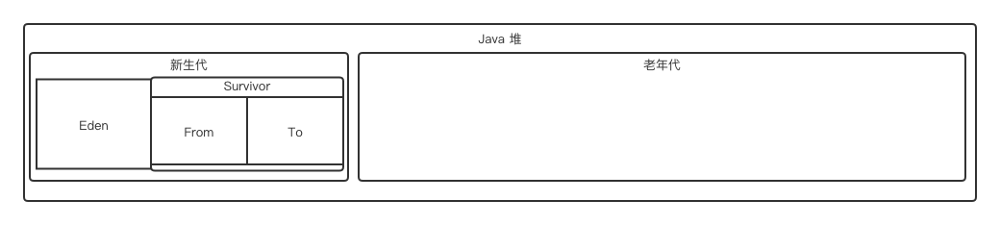

# CPU
## Cache line
缓存行对齐。  
CPU寄存器每次去内存读数据时，都是以64个字节为一个基本单位的。缓存行 64byte 是 CPU 同步的基本单位，缓存行隔离会比伪共享效率高。

##  MESI
cache一致性协议 Modify, Exclusive, Shared, Invalid

## 合并写
CPU内部4byte buffer

# JVM
## Volatile
内存屏障

## Java 对象初始化

创建 class Y 的执行顺序及对应字段值
```java

// class x
public class X {
	protected int xMask = 0x00ff;
	protected int fullMask;

	public X() {
		fullMask = xMask;
	}

	public int mask(int origin) {
		return (origin & fullMask);
	}

}

// class y
class Y extends X {

	protected int yMask = 0xff00;

	public Y() {
		fullMask |= yMask;
	}

}

```


## 类加载机制
类加载过程可以分为 **加载，连接，初始化**。  
1. **加载**  
	将类如 class 文件读取到内存，比为之创建 `java.lang.Class` 对象。
2. **链接**  
	链接过程负责对二进制字节码的格式进行校验、初始化装载类中的静态变量以及解析类中调用的接口、类。在完成了校验后，JVM初始化类中的静态变量，并将其值赋为默认值。最后一步为对类中的所有属性、方法进行验证，以确保其需要调用的属性、方法存在，以及具备应的权限（例如public、private域权限等），会造成NoSuchMethodError、NoSuchFieldError等错误信息。
	* **校验** – 字节码校验器会校验生成的字节码是否正确，如果校验失败，我们会得到校验错误。
	> **文件格式验证**：主要验证字节流是否符合Class文件格式规范，并且能被当前的虚拟机加载处理。  
	> **元数据验证**：对字节码描述的信息进行语义的分析，分析是否符合java的语言语法的规范。  
	> **字节码验证**：最重要的验证环节，分析数据流和控制，确定语义是合法的，符合逻辑的。主要的针对元数据验证后对方法体的验证。保证类方法在运行时不会有危害出现。  
	> **符号引用验证**：主要是针对符号引用转换为直接引用的时候，是会延伸到第三解析阶段，主要去确定访问类型等涉及到引用的情况，主要是要保证引用一定会被访问到，不会出现类等无法访问的问题。

	* **准备** – 分配内存并初始化默认值给所有的静态变量。
	* **解析** – 所有符号内存引用被方法区(Method Area)的原始引用所替代。

3. **初始化**
初始化过程即为执行类中的静态初始化代码、构造器代码以及静态属性的初始化，在四种情况下会触发执行初始化过程。
	* 调用了new关键字
	* 类字面常量
	* 反射调用了类中的方法
	* 子类调用了初始化
	* JVM启动过程中指定的初始化类

### 类加载器
* 启动类加载器（Bootstrap ClassLoader）：<JAVA_HOME>/lib
* 扩展类加载器（Extension ClassLoader）：<JAVA_HOME>/lib/ext
* 应用程序类加载器（Application ClassLoader）：加载用户类路径上所指定的类库, -classpath

类加载器加载Class大致要经过如下8个步骤：  
1. 检测此Class是否载入过，即在缓冲区中是否有此Class，如果有直接进入第8步，否则进入第2步。
1. 如果没有父类加载器，则要么Parent是根类加载器，要么本身就是根类加载器，则跳到第4步，如果父类加载器存在，则进入第3步。
1. 请求使用父类加载器去载入目标类，如果载入成功则跳至第8步，否则接着执行第5步。
1. 请求使用根类加载器去载入目标类，如果载入成功则跳至第8步，否则跳至第7步。
1. 当前类加载器尝试寻找Class文件，如果找到则执行第6步，如果找不到则执行第7步。
1. 从文件中载入Class，成功后跳至第8步。
1. 抛出ClassNotFountException异常。
1. 返回对应的java.lang.Class对象。

**全盘负责**：所谓全盘负责，就是当一个类加载器负责加载某个Class时，该Class所依赖和引用其他Class也将由该类加载器负责载入，除非显示使用另外一个类加载器来载入。  
**双亲委派**：所谓的双亲委派，则是先让父类加载器试图加载该Class，只有在父类加载器无法加载该类时才尝试从自己的类路径中加载该类。通俗的讲，就是某个特定的类加载器在接到加载类的请求时，首先将加载任务委托给父加载器，依次递归，如果父加载器可以完成类加载任务，就成功返回；只有父加载器无法完成此加载任务时，才自己去加载。  
采用双亲委派模式的是好处是Java类随着它的类加载器一起具备了一种带有优先级的层次关系，通过这种层级关可以避免类的重复加载，当父亲已经加载了该类时，就没有必要子ClassLoader再加载一次。其次是考虑到安全因素，java核心api中定义类型不会被随意替换，假设通过网络传递一个名为java.lang.Integer的类，通过双亲委托模式传递到启动类加载器，而启动类加载器在核心Java API发现这个名字的类，发现该类已被加载，并不会重新加载网络传递的过来的java.lang.Integer，而直接返回已加载过的Integer.class，这样便可以防止核心API库被随意篡改。  
**缓存机制**:缓存机制将会保证所有加载过的Class都会被缓存，当程序中需要使用某个Class时，类加载器先从缓存区中搜寻该Class，只有当缓存区中不存在该Class对象时，系统才会读取该类对应的二进制数据，并将其转换成Class对象，存入缓冲区中。这就是为很么修改了Class后，必须重新启动JVM，程序所做的修改才会生效的原因。

## GC
Garbage Collector 垃圾收集回收

**堆** heap  
Java 中的堆是 JVM 所管理的最大的一块内存空间，主要用于存放各种类的实例对象。  
堆被划分成两个不同的区域：新生代 ( Young )、老年代 ( Old )。新生代 ( Young ) 又被划分为三个区域：Eden、From Survivor、To Survivor

默认的，新生代 ( Young ) 与老年代 ( Old ) 的比例的值为 1:2 ( 该值可以通过参数–XX:NewRatio 来指定)，即：新生代 ( Young ) = 1/3 的堆空间大小。老年代 ( Old ) = 2/3 的堆空间大小。其中，新生代 ( Young )被细分为 Eden 和 两个 Survivor 区域，这两个 Survivor 区域分别被命名为 from 和 to，以示区分。默认的，Edem : from : to = 8 :1 : 1 ( 可以通过参数–XX:SurvivorRatio 来设定 )，即： Eden = 8/10 的新生代空间大小，from = to = 1/10 的新生代空间大小。  
**栈** stack   
每个线程执行每个方法的时候都会在栈中申请一个栈帧，每个栈帧包括局部变量区和操作数栈，用于存放此次方法调用过程中的临时变量、参数和中间结果。  
**本地方法栈**  
用于支持native方法的执行，存储了每个native方法调用的状态
**方法区**  
存放了要加载的类信息、静态变量、final类型的常量、属性和方法信息。JVM用永久代（PermanetGeneration）来存放方法区，（在JDK的HotSpot虚拟机中，可以认为方法区就是永久代，但是在其他类型的虚拟机中，没有永久代的概念，有关信息可以看周志明的书）可通过-XX:PermSize和-XX:MaxPermSize来指定最小值和最大值。

**Minor GC** 是发生在新生代中的垃圾收集动作，所采用的是**复制算法**。
当对象在 Eden ( 包括一个 Survivor 区域，这里假设是 from 区域 ) 出生后，在经过一次 Minor GC 后，如果对象还存活，并且能够被另外一块 Survivor 区域所容纳( 上面已经假设为 from 区域，这里应为 to 区域，即 to 区域有足够的内存空间来存储 Eden 和 from 区域中存活的对象 )，则使用复制算法将这些仍然还存活的对象复制到另外一块 Survivor 区域 ( 即 to 区域 ) 中，然后清理所使用过的 Eden 以及 Survivor 区域 ( 即from 区域 )，并且将这些对象的年龄设置为1，以后对象在 Survivor 区每熬过一次 Minor GC，就将对象的年龄 + 1，当对象的年龄达到某个值时 ( 默认是 15 岁，可以通过参数 -XX:MaxTenuringThreshold 来设定 )，这些对象就会成为老年代。  
但这也不是一定的，对于一些较大的对象 ( 即需要分配一块较大的连续内存空间 ) 则是直接进入到老年代。

**Full GC** （Major GC）是发生在老年代的垃圾收集动作，所采用的是**标记-清除算法**。
老年代的对象比较稳定，所以MajorGC不会频繁执行。  
在进行MajorGC前一般都先进行了一次MinorGC，使得有新生代的对象晋身入老年代，导致空间不够用时才触发。当无法找到足够大的连续空间分配给新创建的较大对象时也会提前触发一次MajorGC进行垃圾回收腾出空间。  
MajorGC**标记—清除算法**:  首先扫描一次所有老年代，标记出存活的对象;然后回收没有标记的对象。    
MajorGC的耗时比较长，因为要扫描再回收。MajorGC会产生内存碎片，为了减少内存损耗，我们一般需要进行合并或者标记出来方便下次直接分配。  
当老年代也满了装不下的时候，就会抛出OOM（Out of Memory）异常。  
触发：
- 调用System.gc(The call `System.gc()` is effectively equivalent to the call `Runtime.getRuntime().gc()`) 时，系统建议执行Full GC，但是不必然执行
- 老年代空间不足
- 方法区空间不足
- 通过Minor GC后进入老年代的平均大小大于老年代的可用内存
- 由Eden区、survivor-from 区向survivor-to 区复制时，对象大小大于survivor-to可用内存，则把该对象转存到老年代，且老年代的可用内存小于该对象大小

**永久代** 元空间  
指内存的永久保存区域，主要存放Class和Meta（元数据）的信息。  
Class在被加载的时候被放入永久区域。它和和存放实例的区域不同，GC不会在主程序运行期对永久区域进行清理。所以这也导致了永久代的区域会随着加载的Class的增多而胀满，最终抛出OOM异常。  
在Java8中，永久代已经被移除，被一个称为“元数据区”（元空间）的区域所取代。  
元空间的本质和永久代类似，都是对JVM规范中方法区的实现。不过元空间与永久代之间最大的区别在于：元空间并不在虚拟机中，而是使用本地内存。因此，默认情况下，元空间的大小仅受本地内存限制。类的元数据放入 native memory, 字符串池和类的静态变量放入java堆中. 这样可以加载多少类的元数据就不再由MaxPermSize控制, 而由系统的实际可用空间来控制。
