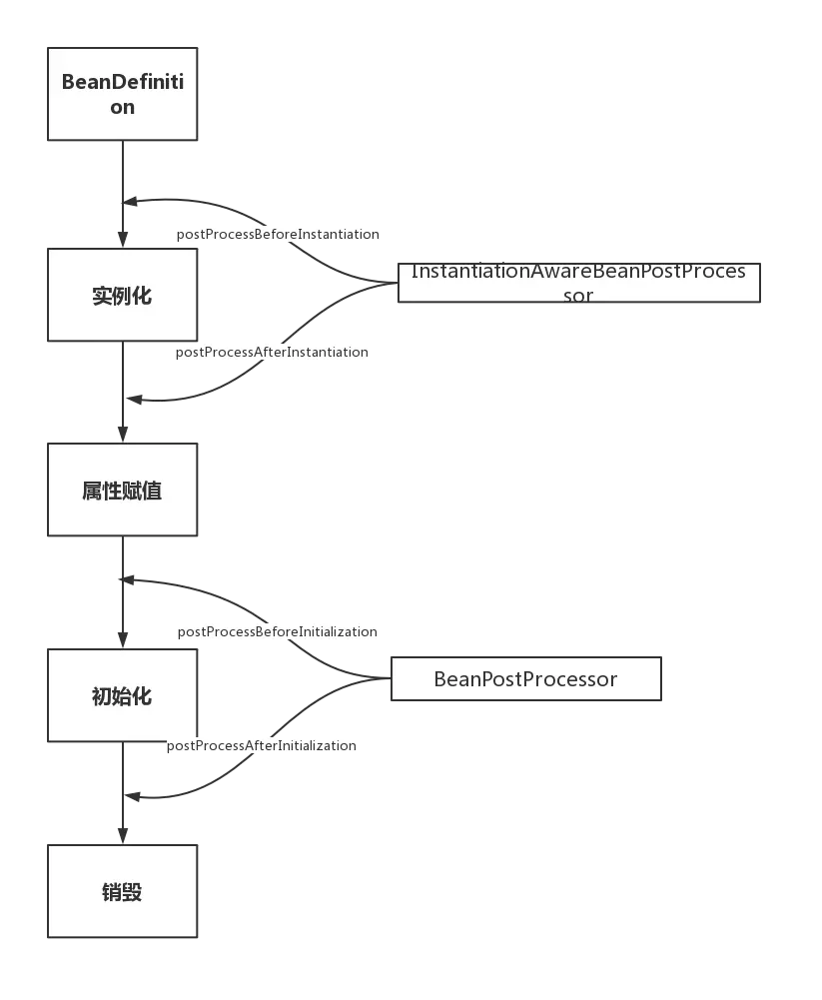

## Spring 问答

### Spring Bean 生命周期

1. **实例化 Instantiation**
2. **属性赋值 Populate**

  3. BeanNameAware
  4. BeanFactoryAware, ApplicationContextAware
  5. BeanPostProcessor#postProcessBeforeInitialization
  6. InitializingBean#afterPropertiesSet
  7. @PostConstruct
3. **初始化 Initialization**
  8. BeanPostProcessor#postProcessAfterInitialization
  9. DisposableBean
  10. @PreDestroy
4. **销毁 Destruction**
  > `ConfigurableApplicationContext#close()`
  > `((AbstractApplicationContext)context).registerShutdownHook(); ` 此代码将注册 jvm系统钩子 `Runtime.getRuntime().addShutdownHook(...)`

> 主线生命周期参考源码  
```
org.springframework.beans.factory.support.AbstractAutowireCapableBeanFactory
doCreateBean
createBean
```




### PostConstruct,PreDestroy 实现原理
在 xml 配置中这两个注解分别对应 init-method， destory-method

Constructor > @Autowired > @PostConstruct

具体参考 [Spring Bean 生命周期](#Spring-Bean-生命周期) 源码参考部分

### Spring 事务隔离级别与传播机制
#### 事务传播机制
```
@Transactional(propagation=Propagation.REQUIRED)
```
* REQUIRED : 如果有事务则加入事务，如果没有事务，则创建一个新的（默认值）
* NOT_SUPPORTED : Spring不为当前方法开启事务，相当于没有事务
* REQUIRES_NEW : 不管是否存在事务，都创建一个新的事务，原来的方法挂起，新的方法执行完毕后，继续执行老的事务
* MANDATORY : 必须在一个已有的事务中执行，否则报错
* NEVER : 必须在一个没有的事务中执行，否则报错
* SUPPORTS : 如果其他bean调用这个方法时，其他bean声明了事务，则就用这个事务，如果没有声明事务，那就不用事务
* NESTED : 如果当前存在事务，则在嵌套事务内执行。如果当前没有事务，则执行与REQUIRED类似的操作

#### 隔离级别
```
@Transactional(isolation=Isolation.DEFAULT)
```
* ISOLOCATION_DEFAULT:  数据库默认级别。 ORACLE（读已提交） MySQL（可重复读）
* ISOLOCATION_READ_UNCOMMITTED: 允许读取未提交的读， 可能导致脏读，不可重复读，幻读
* ISOLOCATION_READ_COMMITTED:  允许读取已提交的读，可能导致不可重复读，幻读
* ISOLOCATION_REPEATABLE_READ : 不能能更新另一个事务修改单尚未提交(回滚)的数据，可能引起幻读
* ISOLOCATION_SERIALIZABLE: 序列执行效率低

### Bean的作用域
```java
@Service
@Scope(ConfigurableBeanFactory.SCOPE_SINGLETON)
public class MilestoneServiceImpl implements MilestoneService {
}
```

* org.springframework.beans.factory.config.ConfigurableBeanFactory#SCOPE_PROTOTYPE

  唯一bean实例，Spring中的bean默认都是单例的。

* org.springframework.beans.factory.config.ConfigurableBeanFactory#SCOPE_SINGLETON

  每次请求都会创建一个新的bean实例。

* org.springframework.web.context.WebApplicationContext#SCOPE_REQUEST

  每一次HTTP请求都会产生一个新的bean，该bean仅在当前HTTP request内有效

* org.springframework.web.context.WebApplicationContext#SCOPE_SESSION

  每一次HTTP请求都会产生一个新的bean，该bean仅在当前HTTP session内有效。

默认单例情况下，有可能发生线程安全问题。当多个线程操作同一个对象的时候，对这个对象的非静态成员变量的写操作会存在线程安全问题。

1. 在bean对象中尽量避免定义可变的成员变量
2. 使用 ThreadLocal。Spring 源码中多种上下文都是这么使用的

### Spring框架中用到了哪些设计模式
* 工厂设计模式：Spring使用工厂模式通过BeanFactory和ApplicationContext创建bean对象。
* 代理设计模式：Spring AOP功能的实现。
* 单例设计模式：Spring中的bean默认都是单例的。
* 模板方法模式：Spring中的jdbcTemplate、hibernateTemplate等以Template结尾的对数据库操作的类，它们就使用到了模板模式。
* 包装器设计模式：我们的项目需要连接多个数据库，而且不同的客户在每次访问中根据需要会去访问不同的数据库。这种模式让我们可以根据客户的需求能够动态切换不同的数据源。
* 观察者模式：定义对象间的一种一对多的依赖关系，当一个对象的状态发生改变时，所有依赖于它的对象都得到通知并被自动更新。spring中Observer模式常用的地方是listener的实现。如ApplicationListener。
* 适配器模式：Spring AOP的增强或通知（Advice）使用到了适配器模式、Spring MVC中也是用到了适配器模式适配Controller。

## Spring Security
[SSO OAuth关键概念](../DevOps/SSO.md)
### Spring-Security-OAuth
关键源码位置，结合[官网文档](https://projects.spring.io/spring-security-oauth/docs/oauth2.html)效果更好
#### 授权

* 授权端点 `/oauth/authorize`
```java
org.springframework.security.oauth2.provider.endpoint.AuthorizationEndpoint
```

* 授权确认端点 `/oauth/confirm_access`
```java
org.springframework.security.oauth2.provider.endpoint.WhitelabelApprovalEndpoint
```
  客户端是否自动确认授权取决于 `org.springframework.security.oauth2.providerClientDetails#isAutoApprove`

* 授权失败端点 `/oauth/error`
```java
org.springframework.security.oauth2.provider.endpoint.WhitelabelErrorEndpoint
```

* 自定义上面两个URL
```java
org.springframework.security.oauth2.config.annotation.web.configuration.AuthorizationServerEndpointsConfiguration#authorizationEndpoint
org.springframework.security.oauth2.config.annotation.web.configurers.AuthorizationServerEndpointsConfigurer#pathMapping
```


#### 获得 token
* 获得令牌端点 `/oauth/token`
```java
org.springframework.security.oauth2.provider.endpoint.TokenEndpoint
```
* 生产 Token
```java
org.springframework.security.oauth2.provider.token.AbstractTokenGranter
```

#### 获得 Token Key
返回 JWT具体算法和公钥，如果没有使用 `KeyPair` 直接用 `SigningKey` 将直接这个 `SigningKey` 这是很危险的
* 获得令牌签名（公钥）端点 `/oauth/token_key`
```java
org.springframework.security.oauth2.provider.endpoint.TokenKeyEndpoint
```

#### 验证解析 Token
* 验证解析令牌端点 `/oauth/check_token`
```java
org.springframework.security.oauth2.provider.endpoint.CheckTokenEndpoint
```
  官方文档介绍，主要考虑授权服务与资源服务分开的情况，`RemoteTokenServices` 它将允许资源服务器通过HTTP请求来解码令牌（也就是授权服务的 `/oauth/check_token` 端点）。如果你的资源服务没有太大的访问量的话，那么使用`RemoteTokenServices` 将会很方便（所有受保护的资源请求都将请求一次授权服务用以检验token值），或者你可以通过缓存来保存每一个token验证的结果

* 验证流程
```java
org.springframework.security.oauth2.provider.authentication.OAuth2AuthenticationProcessingFilter
```
  从 `header(Bearer Token Header)` 、`query(access_token)` 里获取 token 进行认证处理

#### 异常
* 默认处理
```java
org.springframework.security.oauth2.provider.error.DefaultWebResponseExceptionTranslator
```

* Spring MVC 处理
  `@ExceptionHandler` `HttpMessageConverters`
